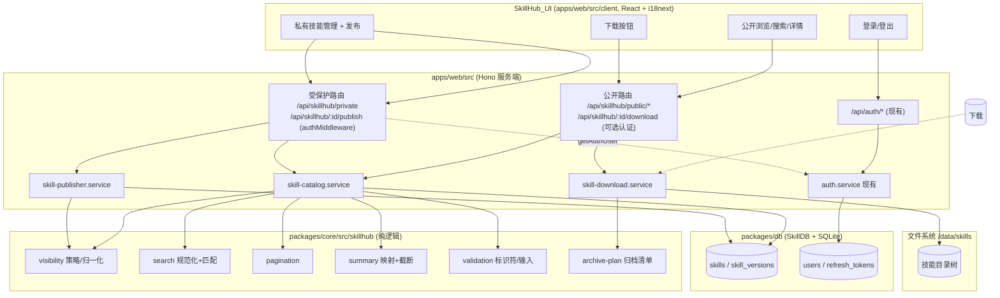
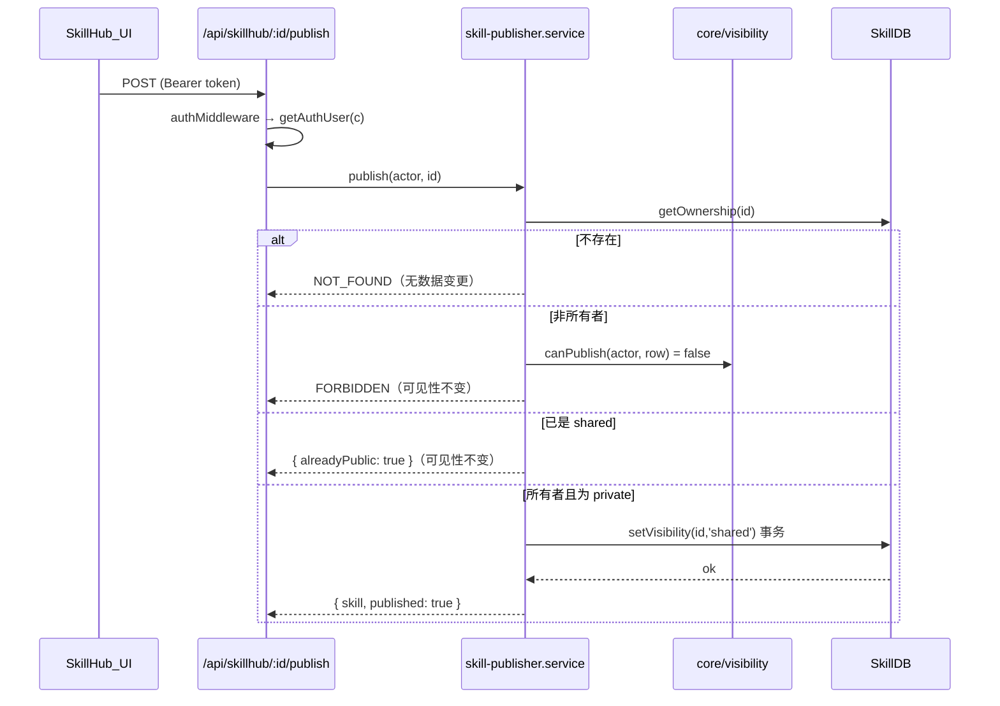
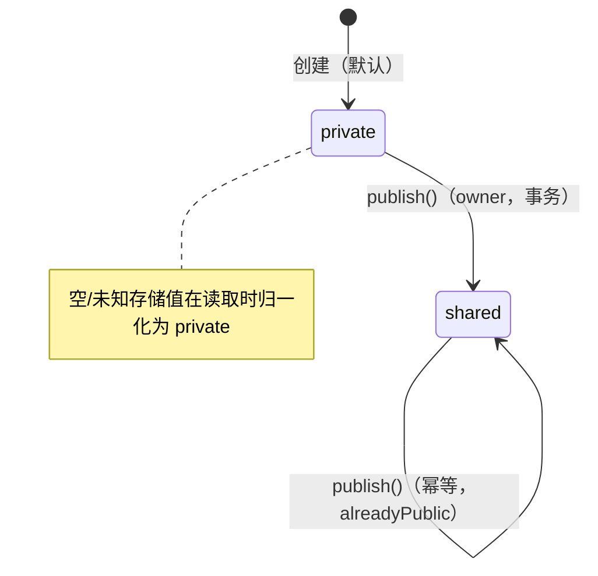

# 设计文档：SkillHub 技能管理

## Overview
<!-- 概述 -->

SkillHub 在自托管 Web 应用（`apps/web`）中提供一个面向多用户、需要登录的技能浏览/搜索/下载/发布界面。它复用 PromptHub 单体仓库已有的存储原语（`packages/db` 的 `skills` / `users` / `refresh_tokens` 表）、认证系统（`apps/web` 的 `auth.service.ts` + JWT + bcrypt）以及技能工作区（`apps/web` 的 `skill-workspace.ts`，落盘于 `<DATA_ROOT>/data/skills/<slug>__<id>/`）。

本设计遵循 `AGENTS.md` 的所有权与依赖方向规则：

- **纯策略/规范化逻辑**（可见性归一化、搜索查询规范化、子串匹配、描述截断、分页、归档清单计算、标识符与搜索输入校验）放入 `packages/core`，作为无副作用、可被属性测试覆盖的纯函数。这是需求术语表中“技能目录服务（Skill_Catalog_Service）位于 `packages/core`”的落点。
- **存储原语**（按可见性/所有者查询、设置可见性的事务写入）放入 `packages/db` 的 `SkillDB`，所有 SQL 使用参数化占位符。
- **共享契约**（请求/响应类型、错误码、常量）放入 `packages/shared`。
- **应用编排与 I/O**（HTTP 路由、归档打包、文件系统读取、认证中间件）放入 `apps/web`。

### 研究结论摘要（影响设计的关键事实）

1. **存储已就绪**：`packages/db/src/schema.ts` 中 `skills` 表已带 `owner_user_id TEXT REFERENCES users(id) ON DELETE SET NULL` 与 `visibility TEXT NOT NULL DEFAULT 'private' CHECK(visibility IN ('private','shared'))`，并已有 `idx_skills_visibility`、`idx_skills_owner` 索引。**因此本设计复用现有列作为单一事实来源，不引入并行的“技能-用户关系表”**（解决开放问题 2 与 3）。
2. **认证已就绪**：`auth.service.ts` 提供 `login/logout/refresh/verifyAccessToken`，使用 HS256 JWT（access TTL 默认 900s，refresh TTL 默认 7 天），refresh token 哈希入库；`auth-rate-limit.ts` 已实现按 IP+用户名滑动窗口限流（登录默认 5 次 / 15 分钟）。
3. **路由挂载现状**：`app.ts` 中所有 `/api/skills/*` 都挂在 `protectedApi`（全局 `authMiddleware()`）之后，**匿名访客无法访问**。SkillHub 的匿名浏览/搜索/下载必须挂在一个**独立的、不在 `protectedApi` 下的公开路由**上。
4. **技能工作区落盘**：`skill-workspace.ts` 已将每个技能写为目录 `<slug>__<id>/`，包含保留文件 `skill.json`、入口 `SKILL.md`、`versions/`、以及任意附加文件。下载归档从该目录树组装。
5. **搜索后端选择**：当前仅 `prompts_fts`（FTS5）存在，`skills` 无 FTS 表。需求 2.4 要求“将 FTS 操作符视为字面文本且不报错”，这与 FTS5 的解析行为相悖。**因此本设计采用基于 `LIKE ... ESCAPE` 的参数化子串过滤（不引入 skills_fts）**（解决开放问题 5），天然将操作符当作字面量；对 ≤10000 行做带索引前过滤 + 内存匹配可在 2 秒内完成。

### 设计冲突与开放问题的处置（依据 AGENTS.md 0.6 设计冲突停止规则）

以下两项曾与现有实现/约束存在实质冲突，**均已获用户确认并在此固定决策**；其余按上文研究结论解决。

> **冲突 A — 发布权限模型（已确认）**：现有 `apps/web/src/services/skill.service.ts` 规定“只有 `admin` 角色才能创建/修改/发布 `shared` 技能”（`assertCanCreate`/`assertCanWrite` 中 `actor.role !== 'admin'` 即拒绝）。而需求 6 要求**任意已认证用户都能把自己拥有的私有技能发布为公开**（仅校验所有者身份，非角色）。**已确认采纳「基于所有者」模型**（与需求 6.1/6.3 一致）：`skills.owner_user_id === actor.userId` 的所有者可发布自己的私有技能，非所有者一律 `FORBIDDEN`。
>
> 关键约束（改动局部化）：SkillHub 发布走**新增的** `skill-publisher.service.ts`，使用 core 的 `canPublish` 基于所有者判断；**不改动现有 `apps/web/src/services/skill.service.ts` 的 admin-only 行为**。两套逻辑并存——`skill.service.ts` 维持其既有的 admin-only 创建/修改/发布契约，SkillHub 的发布路径独立于它——以将改动局部化、避免破坏现有功能契约。
>
> **冲突 B — 认证边界与空闲超时（已确认）**：分两部分固定决策。
>
> - **B1（用户名/密码长度上限）**：需求 4.9 要求用户名上限 254、密码上限 128；现有 `routes/auth.ts` 的全局 zod schema 为用户名 3–50、密码 8–512。**已确认**：SkillHub 适配层采用需求值（用户名上限 254、密码上限 128）作为 **SkillHub 新注册/校验入口**的边界，但**不改动现有 `routes/auth.ts` 的全局 zod schema**（用户名 3–50、密码 8–512），登录校验沿用现有逻辑。明确记录“登录与注册/SkillHub 校验边界不完全一致”是**有意为之**：避免收紧密码上限（512→128）影响存量用户——存量用户可能已设置 >128 字符的密码，若在登录处收紧将把他们锁在门外。
> - **B2（30 分钟空闲失效）**：现有 JWT 为固定 15 分钟 access TTL + 7 天 refresh，无空闲跟踪。**已确认采纳设计原方案**：在访问/刷新校验时记录“最近活动时间”（如在会话记录 / `refresh_tokens` 上增加 `last_active_at`），每次校验比对并更新，实现 30 分钟滑动空闲失效（需求 4.8）。该项为**增量改动**，不破坏现有 JWT 流程。
>
> **开放问题 1 — 桌面端 IPC（已解决为不需要）**：桌面端 `prompthub.db` 为本地优先、单用户，SkillHub 的多用户/登录语义不适用。本设计**仅在 `apps/web` 落地**，不新增 `packages/shared/constants/ipc-channels.ts` 中的渲染进程→preload→主进程通道。
>
> **开放问题 4 — 公开技能物理存储（已解决）**：公开技能的可下载包就是其在 `getSkillsDir()` 下的目录树（`<slug>__<id>/`，排除保留项）。发布只改变 `skills.visibility`，文件位置不变；公开下载由下载服务在请求时按归档清单组装，不预生成静态包。

## Architecture
<!-- 架构 -->

### 进程与依赖方向



依赖方向满足 `AGENTS.md`：`packages/core` 不依赖 `apps/*` 与 Electron；`apps/web` 服务依赖 `@prompthub/core`、`@prompthub/db`、`@prompthub/shared`；UI 不持有持久化业务规则。

### 路由挂载策略（解决匿名访问问题）

在 `app.ts` 中新增两处挂载：

- **公开路由**直接挂在 `app` 上（不经过 `protectedApi`）：
  - `app.route('/api/skillhub', skillhubPublicRoutes)`
  - 其中 `/public`、`/public/search`、`/public/:id` 为纯匿名；`/:id/download` 使用**可选认证中间件**（存在有效 token 则解析出 `userId/role`，否则按匿名处理），以便所有者可下载自己的私有技能。
- **受保护路由**挂在 `protectedApi`（已有全局 `authMiddleware()`）下，使用不同子路径以避免与公开路由冲突：
  - `protectedApi.route('/skillhub', skillhubPrivateRoutes)` 提供 `GET /private`（本人私有技能列表）与 `POST /:id/publish`（发布）。

公开与受保护路由前缀均为 `/api/skillhub/*` 但子路径互不重叠（`/public/*`、`/:id/download` vs `/private`、`/:id/publish`），因此挂载不产生歧义。

### 关键流程

发布流程（需求 6）：



## Components and Interfaces
<!-- 组件与接口 -->

### packages/shared（契约）

新增 `packages/shared/types/skillhub.ts` 与常量（导出到包入口）：

```ts
export type SkillVisibility = 'private' | 'shared';

export interface SkillPublicSummary {
  id: string;
  name: string;
  description: string; // 已截断至 ≤500 字符（不足则原样）
}

export interface SkillPrivateSummary {
  id: string;
  name: string;
  description: string;
  visibility: SkillVisibility;
}

export interface SkillDetail {
  id: string;
  name: string;
  description: string;
  visibility: SkillVisibility;
  ownerUserId: string | null;
  skillMd: string | null;        // SKILL.md 内容；不可用时为 null
  skillMdAvailable: boolean;     // 对应需求 1.8 / 5.8
}

export interface PaginatedResult<T> {
  items: T[];
  total: number;       // 命中的公开技能总数
  page: number;        // 1-based 当前页码
  pageSize: number;    // 固定 20
  startIndex: number;  // 0-based 本页首条全局索引（空页为 0）
  endIndex: number;    // 0-based 本页末条全局索引（含；空页为 -1）
}

export interface SkillArchiveResult {
  fileName: string;          // 形如 <slug>.zip
  byteLength: number;
  body: Uint8Array;          // 或服务端流；MVP 用缓冲
}

export const SKILLHUB = {
  PAGE_SIZE: 20,
  DESCRIPTION_MAX: 500,         // 摘要描述截断
  SEARCH_MATCH_MAX: 200,        // 用于匹配的查询截断长度（需求 2.3）
  SEARCH_INPUT_MAX: 256,        // 输入校验上限（需求 8.6）
  ARCHIVE_MAX_UNCOMPRESSED_BYTES: 500 * 1024 * 1024,
  IGNORED_ENTRIES: ['.git', '.prompthub'] as const,
  // 技能标识符为 uuid v4（与 SkillDB 一致）
  SKILL_ID_PATTERN: /^[0-9a-f]{8}-[0-9a-f]{4}-[0-9a-f]{4}-[0-9a-f]{4}-[0-9a-f]{12}$/i,
} as const;

export const SkillHubErrorCode = {
  VALIDATION_ERROR: 'VALIDATION_ERROR',
  NOT_FOUND: 'NOT_FOUND',
  UNAUTHORIZED: 'UNAUTHORIZED',
  FORBIDDEN: 'FORBIDDEN',
  ARCHIVE_FAILED: 'ARCHIVE_FAILED',
  ARCHIVE_TOO_LARGE: 'ARCHIVE_TOO_LARGE',
  INTERNAL_ERROR: 'INTERNAL_ERROR',
} as const;
```

### packages/core/src/skillhub（纯逻辑，无 I/O）

所有函数为纯函数，输入输出确定，便于属性测试。

```ts
// visibility.ts
export function normalizeVisibility(value: string | null | undefined): SkillVisibility;
// 仅 'shared' → 'shared'；其余（含 null/''/未知/'private'）→ 'private'（需求 7.8）
export function assertWritableVisibility(value: unknown): SkillVisibility;
// 不是 'private'|'shared' 抛 ValidationError（需求 7.6/7.7）
export function canRead(actor: Actor | null, owner: string | null, vis: SkillVisibility): boolean;
export function canDownload(actor: Actor | null, owner: string | null, vis: SkillVisibility): boolean;
export function canPublish(actor: Actor, owner: string | null): boolean; // owner === actor.userId

// search.ts
export interface NormalizedQuery { isEmpty: boolean; term: string; } // term 已 trim+截断200+小写
export function normalizeSearchQuery(raw: string): NormalizedQuery;     // 需求 2.1/2.2/2.3
export function matchesQuery(name: string, description: string | null, q: NormalizedQuery): boolean; // 不区分大小写子串（需求 2.6）
export function buildLikePattern(term: string): { pattern: string; escape: '\\' }; // 转义 % _ \，操作符字面化（需求 2.4）

// summary.ts
export function truncateDescription(desc: string | null): string;       // ≤500（需求 1.3）
export function toPublicSummary(row: SkillCatalogRow): SkillPublicSummary;
export function toPrivateSummary(row: SkillCatalogRow): SkillPrivateSummary; // 含 visibility（需求 5.3）

// pagination.ts
export function paginate<T>(items: T[], page: number, pageSize: number): PaginatedResult<T>; // 需求 1.5

// validation.ts
export function validateSkillId(id: string): string;          // 不匹配 SKILL_ID_PATTERN → ValidationError（需求 8.6/8.7）
export function validateSearchInput(raw: string): string;     // 长度 0..256、无 \x00、无控制字符（需求 8.6/8.7）

// archive-plan.ts
export interface ArchiveEntry { relativePath: string; byteLength: number; }
export function planArchiveEntries(entries: ArchiveEntry[]): ArchiveEntry[];
// 过滤掉以 IGNORED_ENTRIES 任一为顶层目录/名的条目（需求 3.3）；
// 累计未压缩大小 > ARCHIVE_MAX_UNCOMPRESSED_BYTES 抛 ArchiveTooLarge（需求 3.4）
export class ValidationError extends Error {}
export class ArchiveTooLargeError extends Error {}
```

排序约定：公开浏览结果按 `name` 升序、不区分大小写、稳定排序（需求 1.1）。排序在 `SkillDB` 查询层用 `ORDER BY name COLLATE NOCASE ASC, id ASC` 完成，core 不重排以避免重复职责。

### packages/db（存储原语，扩展 SkillDB）

在 `packages/db/src/skill.ts` 的 `SkillDB` 上新增方法（全部参数化）：

```ts
interface SkillCatalogRow {
  id: string;
  name: string;
  description: string | null;
  owner_user_id: string | null;
  visibility: string | null;
}

class SkillDB {
  // 公开浏览：按 name 升序，分页
  listShared(limit: number, offset: number): SkillCatalogRow[];
  countShared(): number;

  // 公开搜索：LIKE 参数化 + ESCAPE，操作符字面化
  searchShared(likePattern: string, escape: string): SkillCatalogRow[];

  // 本人私有技能（需求 5.1/5.2/7.5：owner 非空且等于 requester 且 private）
  listPrivateByOwner(ownerUserId: string): SkillCatalogRow[];

  // 所有权与可见性
  getOwnership(id: string): SkillCatalogRow | null;
  setVisibility(id: string, visibility: SkillVisibility): boolean; // 单事务（需求 6.6/6.8）
}
```

`setVisibility` 实现要点：

```sql
-- 在 db.transaction 内：
UPDATE skills SET visibility = ?, updated_at = ? WHERE id = ?;
```

`visibility` 列已有 `CHECK(visibility IN ('private','shared'))`，对非法值写入由数据库与 core 的 `assertWritableVisibility` 双重拒绝（需求 7.7）。`owner_user_id` 的 `ON DELETE SET NULL` 已满足需求 7.9 中“若引入关系表则用 CASCADE/SET NULL”的等价约束（本设计未引入关系表，故 7.9 以复用现有列且不重复状态的方式满足）。

迁移：本设计不改变 `skills` 表结构，无需 `init.ts` 迁移。仅新增一个用于名称排序的索引以保障 10000 行的浏览性能：

```sql
CREATE INDEX IF NOT EXISTS idx_skills_name_nocase ON skills(name COLLATE NOCASE);
```

该索引在 `schema.ts`（新装）与 `init.ts`（既有用户，幂等 `CREATE INDEX IF NOT EXISTS`）中各加一次。

### apps/web 服务

- `skill-catalog.service.ts`（编排 Skill_Catalog_Service）：
  - `browsePublic(page)`：`validateSearchInput` 无关；调用 `SkillDB.countShared` + `listShared(PAGE_SIZE, offset)` → `toPublicSummary` → `paginate` 元数据组合。
  - `searchPublic(rawQuery, page)`：`validateSearchInput(rawQuery)` → `normalizeSearchQuery` → 空则等价 `browsePublic`；否则 `buildLikePattern` → `SkillDB.searchShared` → `matchesQuery` 复核（保证大小写与字面语义一致）→ `paginate`。
  - `getPublicDetail(id)`：`validateSkillId` → `getOwnership` → `canRead(null,...)`（仅 shared 可匿名读）→ 读取 `SKILL.md` 内容，缺失则 `skillMdAvailable=false`（需求 1.8）。
  - `listPrivate(actor)`：要求 actor → `SkillDB.listPrivateByOwner` → `toPrivateSummary`（需求 5）。
  - `getPrivateDetail(actor, id)`：`validateSkillId` → `getOwnership` → `canRead(actor,...)`，非所有者私有 → `NOT_FOUND`（需求 8.2）。
- `skill-download.service.ts`（Skill_Download_Service）：
  - `download(actor|null, id)`：`validateSkillId` → `getOwnership`（缺失 → `NOT_FOUND`，需求 3.6）→ `canDownload`（非所有者私有 → `FORBIDDEN`，需求 3.5）→ 解析技能目录 → 遍历文件得 `ArchiveEntry[]` → `planArchiveEntries`（排除忽略项、校验 500MB）→ 在内存/临时缓冲完整打包为 ZIP，**仅在完整成功后返回**；任何中途失败抛 `ARCHIVE_FAILED` 且不返回部分内容（需求 3.7）。
  - 打包库：使用已在仓库可用的归档实现（如 `archiver`/`adm-zip` 之一；实现阶段择一并写入 `implementation.md`）；core 只做清单与大小决策，I/O 在此。
- `skill-publisher.service.ts`（Skill_Publisher，**SkillHub 专用、独立于现有 `skill.service.ts`**）：
  - 权限模型为**基于所有者**（冲突 A 已确认）：使用 core 的 `canPublish(actor, owner)`（`owner === actor.userId`）判断，而非角色。该服务**不复用、也不改动** `apps/web/src/services/skill.service.ts` 的 admin-only 逻辑，两套逻辑并存以将改动局部化、避免破坏现有功能契约。
  - `publish(actor, id)`：`getOwnership` → 不存在 `NOT_FOUND`（6.7）→ `canPublish` 否则 `FORBIDDEN`（6.3）→ 若已 `shared` 返回 `{ alreadyPublic: true }` 不写库（6.4）→ 否则 `SkillDB.setVisibility(id,'shared')` 单事务（6.1/6.6），失败回滚保持 `private`（6.8）。发布只改可见性，`owner_user_id/id/name/description/content` 与目录树不变（6.5）。
- 认证沿用现有 `auth.service.ts`/`middleware/auth.ts`；可选认证中间件 `optionalAuth()` 为下载端点新增：有 token 则 `verifyAccessToken` 注入 `userId/role`，无/无效则不抛错继续匿名。
  - **认证边界（冲突 B 已确认）**：SkillHub 的新注册/校验入口采用需求值——用户名上限 254、密码上限 128（需求 4.9）。**不改动** `routes/auth.ts` 的全局 zod schema（用户名 3–50、密码 8–512）；登录校验沿用现有逻辑。登录与注册/SkillHub 校验边界不完全一致为有意为之，以避免收紧密码上限锁住可能已设置 >128 字符密码的存量用户。
  - **空闲超时（冲突 B/B2 已确认）**：在访问/刷新校验时记录“最近活动时间”（如在会话记录 / `refresh_tokens` 上新增 `last_active_at`），每次校验比对并更新，实现 30 分钟滑动空闲失效（需求 4.8）。属增量改动，沿用现有 JWT（15 分钟 access / 7 天 refresh）流程不变。

### apps/web 客户端（SkillHub_UI）与 i18n

- 新增页面/组件于 `apps/web/src/client/pages` 与 `client/api`，所有面向用户文本经 `useTranslation()` 的 `t()`，键采用点号命名 `skillhub.*`（需求 9.1/9.4）。
- 七个 locale 文件（`en/zh/zh-TW/ja/fr/de/es`）同步新增非空翻译键（需求 9.2）。回归测试遍历 locale 文件断言键存在且非空（见测试策略）。
- 缺失键回退默认 `en`（i18next `fallbackLng: 'en'`，需求 9.5），不显示原始键或空串。

## Data Models
<!-- 数据模型 -->

**不新增表、不新增业务列**。复用：

- `skills`：`id`（uuid v4，技能标识符，单一事实来源—需求 7.1）、`name`、`description`、`content`（SKILL.md 内容镜像）、`owner_user_id`（所有者，单一事实来源—需求 7.3，`ON DELETE SET NULL`）、`visibility`（`'private'|'shared'`，单一事实来源—需求 7.2，带 CHECK 约束）、以及技能路径列 `canonical_skill_path`/`local_repo_path`/`directory_fingerprint`。
- `users`：账户身份单一事实来源（需求 7.4）。
- `refresh_tokens`：会话/登出。
- 文件系统 `<DATA_ROOT>/data/skills/<slug>__<id>/`：`SKILL.md`（内容事实来源）、`skill.json`（元数据镜像）、`versions/`、附加文件——下载归档的源。

新增索引：`idx_skills_name_nocase`（名称排序）。

派生只读视图（不持久化）：`SkillPublicSummary`、`SkillPrivateSummary`、`SkillDetail`、`PaginatedResult<T>`、`SkillArchiveResult`，均由 core 从行数据派生。

状态/可见性状态机：



## Correctness Properties
<!-- 正确性属性 -->

属性是一种应在系统所有有效执行中都成立的特征或行为——本质上是关于系统应当做什么的形式化陈述。属性是连接人类可读规格与机器可验证正确性保证之间的桥梁。

下列属性均来自上文 prework 分析，经去冗余后保留。它们覆盖 SkillHub 中可纯函数化、跨大量输入成立的核心逻辑（可见性策略、搜索规范化与匹配、分页、摘要截断、归档往返、发布转换、输入校验）。每个属性最终由**单个**属性测试实现，最少 100 次迭代。

### Property 1: 公开浏览恰为 shared 且按名称升序

*对任意*技能集合（混合可见性、所有者与名称），公开浏览返回的技能恰好是其中 `visibility == 'shared'` 的全部技能（不多不少、不泄漏任何 `private`），且按 `name` 不区分大小写升序、稳定排列。

**Validates: Requirements 1.1, 1.2, 8.3, 8.4**

### Property 2: 公开摘要含必需字段且描述截断至 500

*对任意*技能，其公开摘要恰含 `id`、`name`、`description` 三个字段，且 `description` 长度 ≤ 500 字符，并是原始描述按字符的前缀（原描述 ≤500 时原样保留）。

**Validates: Requirements 1.3**

### Property 3: 分页元数据一致且分页拼接还原全集

*对任意*条目序列、页大小（固定 20）与有效页码，分页结果满足：`total` 等于条目总数；`page` 内条目数 ≤ 页大小；`startIndex/endIndex` 与该页实际条目对应；将所有页依序拼接恰好无重叠、无遗漏地还原原序列。

**Validates: Requirements 1.5**

### Property 4: 搜索匹配语义（不区分大小写子串；空查询返回全部 shared）

*对任意*技能集合与搜索查询，搜索结果恰为满足“`visibility == 'shared'` 且（`name` 或 `description` 以不区分大小写方式包含规范化查询词）”的技能集合；当查询去除首尾空白后为空时，结果等于公开浏览的全部 shared 集合。

**Validates: Requirements 2.1, 2.2, 2.6**

### Property 5: 搜索查询规范化（截断 200 且操作符字面化、永不报错）

*对任意*字符串查询，搜索的匹配行为等价于对“去空白后取前 200 个字符并转小写”的查询词进行字面子串匹配；查询中包含 FTS5/SQL 操作符字符（`AND` `OR` `NOT` `NEAR` `*` `^` `"` `:` `%` `_` `\`）时按字面处理，不抛出任何查询语法错误。

**Validates: Requirements 2.3, 2.4**

### Property 6: 下载归档往返一致（排除忽略项、必含 SKILL.md）

*对任意*技能包目录树（可含 `.git`/`.prompthub`、CJK/特殊字符文件名、二进制内容），将其打包为技能归档后再解压，得到的文件集合与每个文件内容，恰好等于源目录树中排除忽略项 `.git`/`.prompthub` 后的文件集合与内容；且当源包含入口 `SKILL.md` 时，归档必含 `SKILL.md`。

**Validates: Requirements 3.1, 3.2, 3.3, 3.8**

### Property 7: 下载授权

*对任意* actor（含匿名）与技能，下载在“技能为 `shared`，或技能为 `private` 且 actor 为其所有者”时成功产出归档；否则（非所有者请求 `private`）被拒、返回授权错误且不产出任何归档内容。

**Validates: Requirements 3.5, 8.1, 8.2**

### Property 8: 读取/详情授权（shared 对任意访客；private 仅所有者）

*对任意* actor（含匿名）与技能，读取/详情在“技能为 `shared`（无论认证状态）”或“技能为 `private` 且 actor 为其所有者”时返回该技能；对非所有者的 `private` 技能返回未找到/授权错误且不返回任何内容。

**Validates: Requirements 8.1, 8.2, 8.3**

### Property 9: 私有列表隔离（恰为本人 private，排除 null 所有者）

*对任意*多用户、混合可见性的技能集合与任一已认证用户，其私有技能列表恰为“`owner_user_id` 等于该用户且 `visibility == 'private'`”的技能集合：不含任何由他人拥有的技能，也不含任何 `owner_user_id` 为空的技能。

**Validates: Requirements 5.1, 5.2, 7.5**

### Property 10: 私有摘要含必需字段

*对任意*技能，其私有摘要恰含 `id`、`name`、`description`、`visibility` 四个字段。

**Validates: Requirements 5.3**

### Property 11: 无会话的私有操作一律被拒且无副作用

*对任意*私有操作（私有列表、私有详情、发布）请求，当不存在有效已认证会话时，系统拒绝该请求、返回“需要认证”错误、不返回任何技能数据且不产生任何状态变更。

**Validates: Requirements 4.6, 5.6, 8.5**

### Property 12: 发布转换与幂等

*对任意*技能与其所有者，发布操作：当技能为 `private` 时使其 `visibility` 变为 `shared` 并随后可在公开浏览/搜索中检索到；当技能已为 `shared` 时返回“已公开”结果且存储可见性不变（幂等）。

**Validates: Requirements 6.1, 6.2, 6.4**

### Property 13: 发布授权

*对任意*非所有者的已认证用户与技能，发布请求被拒、返回授权错误，且存储的可见性保持不变。

**Validates: Requirements 6.3**

### Property 14: 发布不变量保持

*对任意*技能，发布前后除 `visibility` 外，其 `owner_user_id`、`id`、`name`、`description` 以及技能包内容（目录树）保持不变。

**Validates: Requirements 6.5**

### Property 15: 可见性写入校验与读取归一化

*对任意*可见性写入值，仅 `'private'` 或 `'shared'` 被接受写入；其余值被拒绝、保留现有存储值并返回错误。*对任意*存储侧为空或无法识别的可见性值，读取时归一化为 `'private'` 并将该技能排除于公开结果之外。

**Validates: Requirements 7.6, 7.7, 7.8**

### Property 16: 输入校验先于任何数据库查询

*对任意*技能标识符与搜索输入，在执行任何数据库查询之前进行校验：标识符必须匹配定义的标识符格式；搜索输入长度须在 0..256 之间且不含空字节（`\x00`）或控制字符。任何未通过校验的输入都以校验错误被拒、不触发数据库查询且不返回任何技能内容。

**Validates: Requirements 8.6, 8.7**

> 说明：需求 4.9（用户名/密码长度边界）属于认证适配层的边界校验，作为**示例/边界测试**实现（见测试策略）。冲突 B 已确认：SkillHub 新注册/校验入口采用 254/128 上限，不改动现有全局 zod schema（3–50 / 8–512），登录沿用现有逻辑。需求 7.9 因本设计未引入关系表而前件为假、自动满足，不单列属性。

## Error Handling
<!-- 错误处理 -->

所有服务错误经类型化错误类映射为统一 HTTP 响应（沿用 `utils/response.ts` 的 `error(c, status, code, message)` 与 `ErrorCode`）。后端错误消息使用英文（用于日志），面向用户文案由前端经 i18n 呈现（需求 9）。

| 场景 | 触发 | HTTP | 错误码 | 行为/不变量 |
| --- | --- | --- | --- | --- |
| 非法标识符/搜索输入 | core `validateSkillId`/`validateSearchInput` 抛 `ValidationError` | 422 | `VALIDATION_ERROR` | 不触达 DB，无内容返回（需求 8.6/8.7） |
| 技能不存在 | `getOwnership` 返回 null | 404 | `NOT_FOUND` | 无数据变更（需求 3.6/6.7） |
| 非所有者读/下载 private | `canRead`/`canDownload` 为假 | 404/403 | `NOT_FOUND`/`FORBIDDEN` | 不返回任何内容（需求 3.5/8.2） |
| 无会话访问私有操作 | 缺失/无效 token | 401 | `UNAUTHORIZED` | 不执行操作（需求 4.6/5.6/8.5） |
| 非所有者发布 | `canPublish` 为假 | 403 | `FORBIDDEN` | 可见性不变（需求 6.3） |
| 非法可见性写入 | `assertWritableVisibility` 抛错 / CHECK 约束 | 422 | `VALIDATION_ERROR` | 保留现值（需求 7.7） |
| 归档超限 | `planArchiveEntries` 抛 `ArchiveTooLargeError` | 422 | `ARCHIVE_TOO_LARGE` | 不产出归档（需求 3.4） |
| 归档中途失败 | 打包 I/O 异常 | 500 | `ARCHIVE_FAILED` | 中止、不返回部分归档（需求 3.7） |
| 发布事务失败 | `setVisibility` 事务回滚 | 500 | `INTERNAL_ERROR` | 可见性保持 `private`（需求 6.8） |
| 检索失败 | DB/IO 异常 | 500 | `INTERNAL_ERROR` | 前端显示错误并保留先前状态（需求 1.7/5.7） |
| 登录限流 | `auth-rate-limit` 命中 | 429 | `RATE_LIMITED` | 账户暂时锁定（需求 4.7） |

关键约束：

- 下载与发布的失败路径必须保证**原子性/无半成品**：发布在 `db.transaction()` 内完成；归档仅在完整成功后返回缓冲，任何异常即抛错且不输出部分字节（`AGENTS.md` 失败/回滚要求）。
- 所有 SQL 使用参数化占位符；搜索使用 `LIKE ? ESCAPE '\\'` 并在 core 中转义 `% _ \`；写库前剥离/拒绝空字节（`AGENTS.md` 数据库与空字节规则）。
- 错误消息不泄漏密钥/令牌；登录失败返回统一“凭证无效”，不区分用户名/密码（需求 4.2）。

## Testing Strategy
<!-- 测试策略 -->

采用单元测试 + 属性测试的双重策略；DB 相关使用真实内存 SQLite，不使用 mock（`AGENTS.md` 7.2.5）。

### 适用性评估

SkillHub 同时包含**适合 PBT 的纯逻辑**（可见性策略、搜索规范化与匹配、分页、摘要截断、归档清单/往返、发布转换、输入校验）与**不适合 PBT 的部分**（i18n 完整性、UI 渲染/空状态、归档打包 I/O 失败注入、认证限流/空闲超时、性能阈值）。因此本设计**包含**正确性属性，并对非 PBT 部分使用单元/集成/快照/回归测试。

### 属性测试

- 库：使用 **fast-check**（与 Vitest 集成，TypeScript 生态标准），不自行实现 PBT。
- 每个属性测试最少运行 **100 次**迭代。
- 每个属性测试以注释标注其对应设计属性，标签格式：
  `// Feature: skillhub-management, Property N: <属性文本>`
- 属性 1–16 各由**单个**属性测试实现，主要位于 `packages/core`（纯逻辑）；属性 7/8/9/12/13/14/15 涉及存储的部分在 `apps/web` 服务层用真实内存 SQLite + 随机生成的技能/用户夹具实现。
- 生成器须覆盖对抗性输入（`AGENTS.md` 7.2.2）：CJK/emoji/RTL/零宽字符、空字节与控制字符、SQL 注入与 FTS5 操作符样本、超长字符串、特殊文件名与二进制内容（用于属性 6 往返）。

属性到实现位置映射（摘要）：

| 属性 | 主要实现位置 | 关键生成器 |
| --- | --- | --- |
| P1, P4, P5 | core search/visibility（+web 服务复核） | 混合可见性目录、含操作符/超长/大小写查询 |
| P2, P10 | core summary | 含 >500/CJK 描述 |
| P3 | core pagination | 任意长度序列 + 随机页码 |
| P6 | core archive-plan + web 打包/解压往返 | 含忽略项/特殊文件名/二进制的目录树 |
| P7, P8 | web 服务 + core policy | 任意 actor（含匿名）× 任意可见性/所有者 |
| P9, P15 | core visibility + web SkillDB（内存 SQLite） | 多用户、含 null owner、非法/空可见性 |
| P11, P13 | web 路由/服务 | 无 token、非所有者 actor |
| P12, P14 | web publisher + 内存 SQLite | owner+private / 已 shared 技能 |
| P16 | core validation（+spy 断言未触达 DB） | 非法 id、含空字节/控制字符/超 256 输入 |

### 单元 / 集成 / 回归测试

- **示例/边界**：1.4、1.6、1.7、1.8、2.5、3.4、3.6、3.7、4.2–4.5、4.9、5.4、5.5、5.7、5.8、6.7、6.8。其中 3.7/6.8 注入中途失败断言无部分输出/已回滚。
- **集成（真实 SQLite/真实 auth）**：4.1、4.5、4.7、4.8、6.6；事务原子性、FK `ON DELETE SET NULL`（删除用户后其 shared 技能 owner 置空）、登录限流、空闲失效（推进时间）。
- **i18n 回归（9.2/9.3/9.5）**：遍历 7 个 locale 文件断言所有 `skillhub.*` 键存在且非空；扩展现有“无硬编码中文”回归；删除非 en 键断言回退 en。
- **性能/压力（2.7/3.1）**：10000 个技能搜索 < 2s、500MB 边界归档 < 30s 的时间预算测试（`AGENTS.md` 7.2.4），列入但不计入属性迭代。
- **安全（`AGENTS.md` 7.2.2/7.2.3/8.5）**：路径穿越（`../`、绝对路径、符号链接、空字节）作用于技能目录解析与归档相对路径（复用 `skill-workspace.ts` 的 `normalizeWorkspaceRelativePath` 约束）；SQL 注入样本作用于搜索；下载授权越权用例。

### 覆盖要求

新增/变更代码（`packages/core/src/skillhub/*`、`packages/db/src/skill.ts` 新增方法、`apps/web` 新增服务/路由）目标 100% 行/函数/分支/条件覆盖；DB 与授权属于关键边界模块，须 100% 分支/条件覆盖（`AGENTS.md` 7.6），未覆盖的遗留分支须在活动 change 的 `implementation.md` 记录。

### 已确认决策对测试的影响

- **冲突 A（发布权限）— 已确认基于所有者**：属性 12/13 固定为「基于所有者」语义——属性 12 验证所有者对自有 `private` 技能的发布转换与幂等，属性 13 验证非所有者已认证用户发布被拒（`FORBIDDEN`）且存储可见性不变。两者在 `skill-publisher.service.ts` + core `canPublish` 上实现，使用真实内存 SQLite 与随机所有者/可见性夹具。现有 `skill.service.ts` 的 admin-only 行为不在本特性测试范围内、保持其原有测试不变。
- **冲突 B（认证边界与空闲超时）— 已确认**：
  - 需求 4.9 边界测试固定预期为 **SkillHub 新注册/校验入口**接受用户名长度 ≤254、密码长度 ≤128，并拒绝超限输入；同时增加回归断言**现有 `routes/auth.ts` 全局 schema 不变**（用户名 3–50、密码 8–512），以证明两套边界有意并存且登录路径未被收紧。
  - 需求 4.8 空闲失效集成测试固定预期为：在访问/刷新校验时更新 `last_active_at`，推进时间超过 30 分钟后下一次校验使会话失效；30 分钟内的活动滑动续期。该测试使用确定性时间推进而非真实等待。
