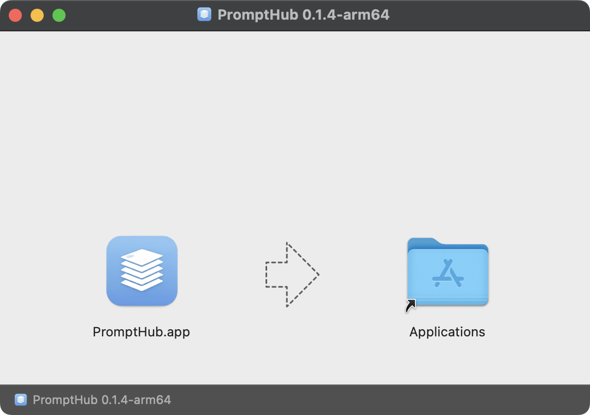
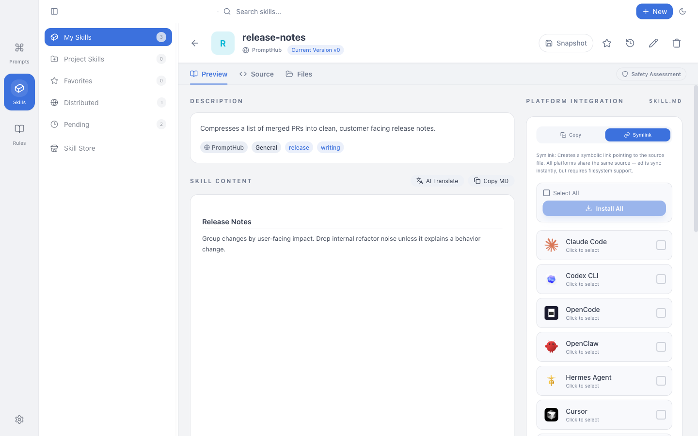
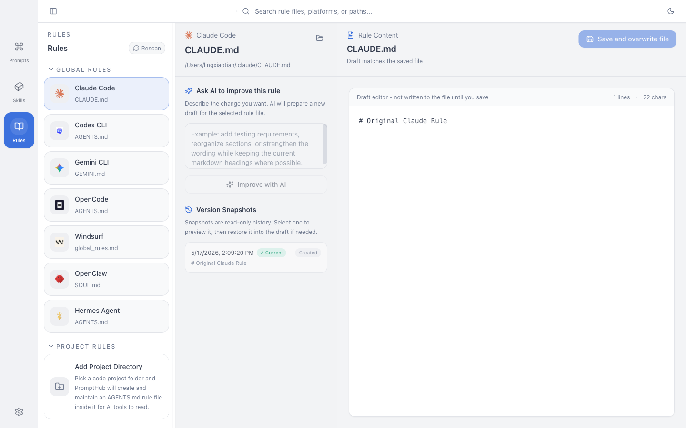
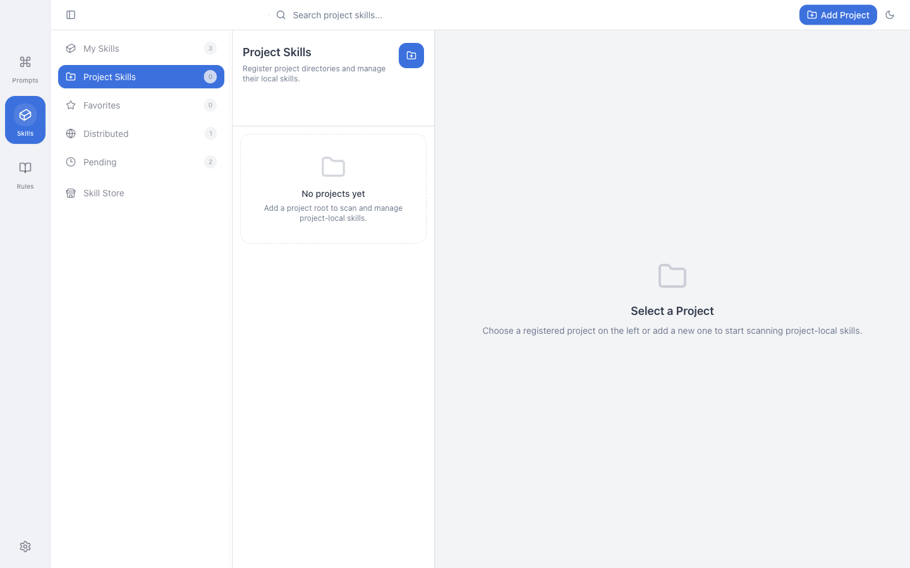
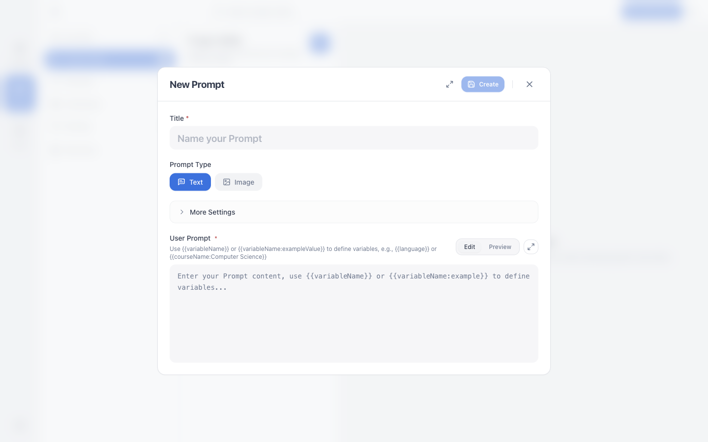
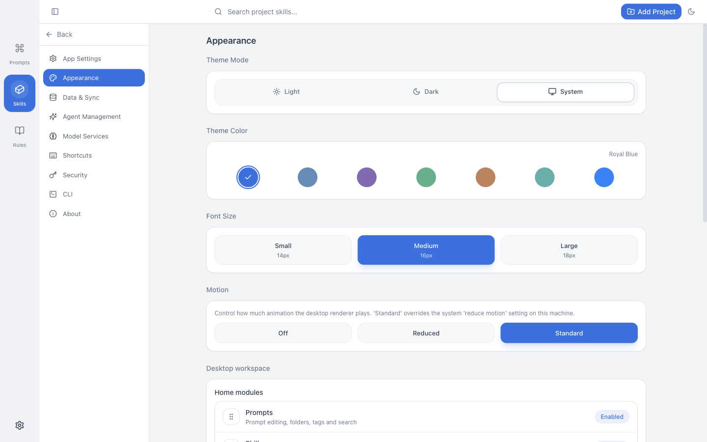

<div align="center">
  

  # PromptHub

  本地优先的 Prompt、Skill 与 AI 编程资产工作台。

  <br/>

  <!-- Badges -->
  [](https://github.com/legeling/PromptHub/stargazers)
  [](https://github.com/legeling/PromptHub/releases)
  [](https://github.com/legeling/PromptHub/releases/latest)
  [](./LICENSE)

  <br/>

  <!-- Tech Stack -->
  
  
  
  
  

  <br/>

  
  
  

  <br/>

  [简体中文](./README.md) · [繁體中文](./docs/README.zh-TW.md) · [English](./docs/README.en.md) · [日本語](./docs/README.ja.md) · [Deutsch](./docs/README.de.md) · [Español](./docs/README.es.md) · [Français](./docs/README.fr.md)

  <br/>

  <a href="https://github.com/legeling/PromptHub/releases/latest">
    
  </a>
</div>

<br/>

PromptHub 把你的 Prompt、SKILL.md 和项目级 AI 编程资产放进一个本地工作区。它能把同一份 Skill 一键安装到 Claude Code、Cursor、Codex、Windsurf、Gemini CLI、Cline 等十几个工具，给 Prompt 做版本管理与多模型测试，并通过 WebDAV 或自部署 Web 同步到其他设备。

数据默认存在你自己的电脑上。

---

## 目录

- [桌面版下载](#install)
- [截图](#screenshots)
- [核心能力](#features)
- [快速上手](#quick-start)
- [自部署网页版](#self-hosted-web)
- [命令行 CLI](#cli)
- [更新日志](#changelog)
- [路线图](#roadmap)
- [从源码运行](#dev)
- [仓库结构](#project-structure)
- [贡献与文档](#contributing)
- [许可证 / 致谢 / 社区](#meta)

---

<div id="install"></div>

## 📥 桌面版下载

最新稳定版 **v0.5.8**。每个平台都有两条下载链路：

- **直链下载** — 文件名固定，链接不会随版本变化，适合做长期书签或脚本调用（稳定版现已接入 CDN 镜像）
- **GitHub Releases** — 官方发布页，可下载历史版本、查看签名与 Release Notes

| 平台    | 直链下载                                                                                                                                                                                                                                                                                                                                                                                                                                                  | GitHub Releases                                                                                                                                                                                                                                                                                                                                                                                                                                                  |
| ------- | --------------------------------------------------------------------------------------------------------------------------------------------------------------------------------------------------------------------------------------------------------------------------------------------------------------------------------------------------------------------------------------------------------------------------------------------------- | ------------------------------------------------------------------------------------------------------------------------------------------------------------------------------------------------------------------------------------------------------------------------------------------------------------------------------------------------------------------------------------------------------------------------------------------------------- |
| Windows | [](https://pub-fff1cbc0121241d480624bd3de5a2735.r2.dev/latest/PromptHub-Setup-x64.exe) [](https://pub-fff1cbc0121241d480624bd3de5a2735.r2.dev/latest/PromptHub-Setup-arm64.exe)                | [](https://github.com/legeling/PromptHub/releases/latest/download/PromptHub-Setup-0.5.8-x64.exe) [](https://github.com/legeling/PromptHub/releases/latest/download/PromptHub-Setup-0.5.8-arm64.exe)                  |
| macOS   | [](https://pub-fff1cbc0121241d480624bd3de5a2735.r2.dev/latest/PromptHub-arm64.dmg) [](https://pub-fff1cbc0121241d480624bd3de5a2735.r2.dev/latest/PromptHub-x64.dmg)                     | [](https://github.com/legeling/PromptHub/releases/latest/download/PromptHub-0.5.8-arm64.dmg) [](https://github.com/legeling/PromptHub/releases/latest/download/PromptHub-0.5.8-x64.dmg)                       |
| Linux   | [](https://pub-fff1cbc0121241d480624bd3de5a2735.r2.dev/latest/PromptHub-x64.AppImage) [](https://pub-fff1cbc0121241d480624bd3de5a2735.r2.dev/latest/PromptHub-amd64.deb)                              | [](https://github.com/legeling/PromptHub/releases/latest/download/PromptHub-0.5.8-x64.AppImage) [](https://github.com/legeling/PromptHub/releases/latest/download/PromptHub-0.5.8-amd64.deb)                                |
| 预览版  | [](https://github.com/legeling/PromptHub/releases) | 暂无单独预览版；需要提前体验新功能时，可在应用内「设置 → 关于」打开「预览版通道」 |

> **macOS 选哪个？** Apple Silicon（M1/M2/M3/M4）选 `arm64`，Intel Mac 选 `x64`。
> **Windows 选哪个？** 绝大多数选 `x64`，只有 Surface Pro X 这类 ARM 设备选 `arm64`。

### macOS 通过 Homebrew

```bash
brew tap legeling/tap
brew install --cask prompthub
```

后续升级请用 `brew upgrade --cask prompthub`，**不要**和应用内自动更新混用，否则可能出现 Homebrew 记录的版本和实际安装不一致。

### macOS 首次启动提示「已损坏」

应用没有 Apple 公证签名，第一次打开可能会弹「无法验证开发者」。打开终端执行：

```bash
sudo xattr -rd com.apple.quarantine /Applications/PromptHub.app
```

然后重新打开就行。如果应用安装在其他位置，把路径替换成实际安装路径。

<div align="center">
  
</div>

### 预览通道

如果你想体验下一版的开发预览版，可以在「设置 → 关于」打开「预览版通道」开关，应用会从 GitHub Prereleases 拉取构建。一旦关掉这个开关，更新会回到稳定版，并且不会从较新的预览版自动降级到较旧的稳定版。

<div id="screenshots"></div>

## 截图

> 下面这几张展示了当前稳定版 0.5.8 的核心交互。

<div align="center">
  <p><strong>主界面（双栏首页）</strong></p>
  
  <br/><br/>
  <p><strong>Skill 商店</strong></p>
  
  <br/><br/>
  <p><strong>Skill 详情与一键安装到平台</strong></p>
  
  <br/><br/>
  <p><strong>Rules 工作区</strong></p>
  
  <br/><br/>
  <p><strong>项目级 Skill 工作区</strong></p>
  
  <br/><br/>
  <p><strong>Quick Add 多入口（手动 / 分析 / AI 生成）</strong></p>
  
  <br/><br/>
  <p><strong>外观与动画偏好</strong></p>
  
</div>

<div id="features"></div>

## 核心能力

### 📝 Prompt 管理

- 文件夹、标签、收藏三层组织，可拖拽排序，CRUD 全覆盖
- 模板变量 `{{variable}}`，复制 / 测试 / 分发时弹表单填值
- 全文搜索（FTS5），Markdown 渲染与代码高亮，附件 / 多媒体预览
- 桌面卡片支持双击进入 inline 编辑用户 Prompt 和 System Prompt

### 🧩 Skill 商店与一键分发

- **技能商店**：内置 20+ 精选技能（来自 Anthropic、OpenAI 等），可叠加自定义商店源（GitHub / skills.sh / 本地目录）
- **一键安装到平台**：Claude Code、Cursor、Windsurf、Codex、Kiro、Kilo Code、Gemini CLI、Cline、Qoder、QoderWork、CodeBuddy、Trae、Trae CN、OpenCode 等 15+ 平台
- **本地扫描**：自动发现本地已有 SKILL.md，预览选择后导入，避免在多个工具目录间复制粘贴
- **Symlink / Copy 双模式**：选 symlink 共享编辑，选 copy 各平台保留独立副本
- **平台目标目录可覆写**：为每个平台单独配置 Skills 目录，扫描和分发保持一致
- **AI 翻译与润色**：以完整 SKILL.md 为单位生成 sidecar 译文，支持沉浸式对照和全文翻译
- **安全扫描**：安装前用 AI 审阅链路检查 Skill 内容，受限来源直接阻断
- **GitHub Token**：商店与仓库导入支持鉴权，减少匿名限流失败
- **标签筛选**：按标签快速过滤已安装与商店技能

### 📐 Rules（AI 编程规则）

- 集中管理 `.cursor/rules`、`.claude/CLAUDE.md`、AGENTS.md 等规则文件
- 支持手动添加项目级 Rules，按目录分组浏览
- 与 ZIP 导出、WebDAV、自托管同步、Web 导入导出全链路打通

### 🤖 项目与 Agent 资产工作区

- 扫描项目里的 `.claude/skills`、`.agents/skills`、`skills`、`.gemini` 等常见目录
- 为单个项目建立独立 Skill 工作区，不污染全局库
- 个人库、本地仓库、项目资产同一界面切换，不用在多个工具目录之间跳来跳去
- 全局 Prompt 标签管理：集中搜索、重命名、合并、删除标签，数据库与工作区文件一并同步

### 🧪 AI 测试与生成

- 内置 AI 测试，主流国内外服务商都能配（OpenAI、Anthropic、Gemini、Azure、自定义 endpoint 等）
- 同一 Prompt 多模型并行对比，文本和图像模型都支持
- AI 生成技能、AI 润色技能、Quick Add AI 直接生成结构化 Prompt 草稿
- 统一的端点管理与连接测试，错误信息精确到 504 / 超时 / 未配置

### 🕒 版本控制与历史

- 每次保存 Prompt 自动写入历史版本，支持版本对比、差异高亮、一键回滚
- Skill 同样维护版本历史，可创建命名版本、查看差异、按版本回滚
- Rules 历史快照可预览、恢复到草稿
- 商店 Skill 安装时记录内容哈希，远端 SKILL.md 变更可检测，本地修改有冲突保护

### 💾 数据、同步与备份

- 本地优先：所有数据默认存在你自己的电脑上
- 全量备份 / 恢复使用 `.phub.gz` 压缩格式
- WebDAV 同步（坚果云、Nextcloud 等）
- 自部署 PromptHub Web 可作为额外的同步源 / 备份源
- 启动时自动拉取 + 后台定时同步；只允许一个活动同步源驱动自动同步，避免多源冲突写入

### 🔐 隐私与安全

- 主密码保护应用入口，AES-256-GCM 加密
- 私密文件夹内容加密存储（Beta）
- 跨平台离线运行：macOS / Windows / Linux
- 7 种界面语言：简体中文、繁體中文、English、日本語、Deutsch、Español、Français

<div id="quick-start"></div>

## 快速上手

1. **新建第一个 Prompt**
   点「+ 新建」，写标题、描述、System Prompt 和 User Prompt。`{{变量名}}` 会变成一个变量，复制或测试时会弹表单让你填。

2. **把 Skills 纳入工作区**
   去「Skills」标签，从商店选几个，或点「扫描本地」让 PromptHub 自动找你电脑上已有的 SKILL.md。

3. **一键安装到 AI 工具**
   在 Skill 详情页选目标平台。PromptHub 会按平台规范把 SKILL.md 安装到对应目录。可以选 symlink（同步编辑）或独立复制。

4. **配置同步（可选）**
   「设置 → 数据」里配 WebDAV，或自部署一份 PromptHub Web 当同步目标。

<div id="self-hosted-web"></div>

## 自部署网页版

PromptHub Web 是一个轻量的浏览器版工作区，你可以用 Docker 把它跑在 NAS、VPS 或局域网里。它**不是**官方云服务，主要用途是：

- 在浏览器里访问自己的 PromptHub 数据
- 给桌面版当作除 WebDAV 之外的另一种同步目标
- 不想让数据出本地局域网

```bash
cd apps/web
cp .env.example .env
docker compose up -d --build
```

`.env` 里有几个必须改的：

- `JWT_SECRET`：≥ 32 位随机字符串
- `ALLOW_REGISTRATION=false`：建议保持关闭，第一个用户初始化完之后就不要再开公开注册
- `DATA_ROOT`：数据根目录，会在下面创建 `data/`、`config/`、`logs/`、`backups/`

默认在 `http://localhost:3871`。第一次打开会跳到 `/setup`，你创建的第一个用户就是管理员。

桌面版接入这一份 Web：「设置 → 数据 → Self-Hosted PromptHub」，填 URL、用户名、密码。可以测连接、上传当前工作区、从 Web 拉回本地、启动时自动拉取、后台定时推送。

更详细的 Docker / NAS / VPS 自部署说明在 [`docs/web-self-hosted.md`](./docs/web-self-hosted.md)。

<div id="cli"></div>

## 命令行 CLI

CLI 适合脚本化管理、批量导入导出、自动化扫描。当前桌面版**不会**自动安装 `prompthub` 命令，需要你从仓库自己打包再装：

```bash
pnpm pack:cli
pnpm add -g ./apps/cli/prompthub-cli-*.tgz
prompthub --help
```

也可以不安装直接跑：

```bash
pnpm --filter @prompthub/cli dev -- prompt list
pnpm --filter @prompthub/cli dev -- skill scan
```

支持的资源命令一览（每个命令都有 `--help`）：

```text
prompt    list / get / create / update / delete / duplicate / search
          versions / create-version / delete-version / diff / rollback
          use / copy
          list-tags / rename-tag / delete-tag

folder    list / get / create / update / delete / reorder

rules     list / scan / read / save / rewrite
          versions / version-read / version-restore / version-delete
          add-project / remove-project
          export / import

skill     list / get / install / delete / remove
          versions / create-version / rollback / delete-version
          export / scan / scan-safety / sync-from-repo
          platforms / platform-status / install-md / uninstall-md
          repo-files / repo-read / repo-write / repo-delete / repo-mkdir / repo-rename

ai        providers / provider-add / provider-delete
          models / model-add / model-delete
          routes / route-set / route-clear

workspace export / import
```

常用全局参数：

- `--output json|table` — 输出格式
- `--data-dir <path>` — 显式指定 PromptHub 的 `userData` 目录
- `--app-data-dir <path>` — 显式指定应用数据根目录
- `--version|-v` — 打印 CLI 版本

<div id="changelog"></div>

## 更新日志

完整版本说明：**[CHANGELOG.md](./CHANGELOG.md)**

### v0.5.8（2026-06-04）

- 图片 Prompt 反推新增独立入口，支持视觉模型生成结构化生图 Prompt，先预览/复制再决定是否保存
- AI 模型配置改为供应商优先的三栏体验，区分供应商、模型能力和业务路由
- ClawHub 与 skill.sh 商店接入远程搜索、分类、分页/滚动加载、缓存和完整 Skill 包安装
- Skill 生命周期矩阵继续加固，覆盖我的 Skill、项目 Skill、Agent Skill、平台安装、copy / symlink、内置 Skill 和外部软链接
- GitHub / Gitea / 自托管 Git 来源更新检查更准确，并忽略常见缓存文件以减少误报
- Skill 文件视图接入轻量代码编辑器，支持语法高亮、行号、自动换行和更准确的文件图标

### v0.5.8-beta.3（2026-06-02，预览版）

- Skill 文件视图接入轻量代码编辑器，支持语法高亮、行号、自动换行和更准确的文件图标
- GitHub 导入到“我的 Skill”的条目现在可以直接检查来源更新，并在更新前创建版本快照
- Cherry Studio、Agent Skill、项目 Skill、copy / symlink、内置 Skill 与外部软链接状态继续补强
- Prompt / Skill 版本历史弹窗改为更适合检索和对比的表格化呈现

### v0.5.8-beta.2（2026-06-02，预览版）

- Skill 生命周期操作继续补强，覆盖项目 Skill、Agent Skill 和平台 Skill 的安装、卸载、删除与软链接路径
- 项目详情页删除按钮改为默认红色 destructive 样式，降低误操作风险
- Skill 管理页和项目/Agent 内部切换统一使用横向过渡动画
- GitHub Actions 发布链路同步到 Node 24

### v0.5.8-beta.1（2026-06-01，预览版）

- 图片 Prompt 反推工作流新增独立入口，支持通过视觉模型反推结构化生图 Prompt，并可把原图作为参考图保存
- AI 模型服务重构为供应商优先的三栏配置体验，区分供应商实例、模型能力和业务路由
- 独立 CLI 的 `--version` 与 package 版本同步到 `0.5.8-beta.1`
- 项目 Skill 结果区改为紧凑列表，次要动作收口为 icon-only

### v0.5.7（2026-05-29）

- Prompt AI 快速编辑：详情页、详情弹窗和右键菜单统一接入 `AI 快速编辑`，支持先生成草稿再应用或继续编辑
- 同名 Skill variant 正式落地：允许同名但不同来源的 Skill 并存，并统一围绕 `source_id` 与托管容器结构收口
- 备份导入恢复链路加固，降低恢复后的状态漂移风险
- `scanRemoteGithub` 统一支持 HTTPS / SSH 的 GitHub、Gitea 和自托管 Git 仓库
- AI Workbench 的 `测试连接` 成功状态现可持久回显，切换回来不会掉回 `未验证`
- Kilo Code 规则扫描补齐，避免新增平台遗漏全局规则文件

### v0.5.7-beta.2（2026-05-28，预览版）

- Git 商店源支持 `branch / directory` 配置、远程分支建议和 GitHub / SSH / 自部署 Git 仓库
- 项目 Skill 导入支持 `copy / symlink` 高级模式，并按项目记住导入偏好与目标目录
- Agent 管理与 Skill 平台安装内置接入 `Kilo Code`，移除 `Roo Code`

### v0.5.7-beta.1（2026-05-26，预览版）

- 统一 built-in / custom agent 完整配置模型，Skill Settings 可直接覆写 `root / skills / rules / agents / commands / config` 路径
- 新增 `Cline`、`Trae CN` 内置平台预设，并让 Rules 工作区按 agent 配置和顺序即时刷新
- 支持把 Skill 直接部署到项目本地 agent 目录，默认 `.agents/skills`，并支持多目标选择
- 平台 symlink 安装回退到 copy 时会明确提示 warning，不再伪装成普通成功
- Prompt 详情双击编辑收口：双击哪块就编辑哪块，编辑态尽量保持原页面结构

### v0.5.6（2026-05-12）

**新功能**

- 🧭 **Rules 集中管理工作台**：桌面端独立的 Rules 页面，统一管理全局规则和手动添加的项目规则，支持搜索、历史快照预览、恢复到草稿，并接入 ZIP 导出、WebDAV、自托管同步和 Web 导入导出
- 📁 **项目级 Skill 工作区**：可以为本地项目建立独立 Skill 工作区，自动扫描常见目录，在项目上下文中预览、导入和分发 Skill
- 🤖 **Quick Add 支持 AI 直接生成 Prompt**：除了分析已有 Prompt，Quick Add 现在也能根据目标和约束直接生成结构化 Prompt 草稿
- 🏷️ **全局 Prompt 标签管理**：侧栏标签区域新增统一入口，可集中搜索、重命名、合并和删除标签，同步更新数据库与工作区文件
- 🔐 **Skill 商店支持 GitHub Token**：减少匿名限流导致的商店和仓库导入失败

**修复**

- ✍️ 卡片详情支持双击编辑用户提示词和系统提示词
- 🪟 修复检查更新弹窗闪烁、下载按钮不可稳定点击，以及开机自启时不能按 `minimizeOnLaunch` 最小化的问题
- ↔️ Skills 三栏列宽调节、双击重置、标题换行、商店搜索的一组易用性回归
- 🔁 Rules、Skill 附加文件和托管副本在 ZIP 导出、WebDAV、自托管同步和 Web 导入导出链路中的一致性
- 🖼️ 自托管 Web 登录改用一次性图形验证码

**优化**

- 🏠 双栏首页稳定支持模块显隐、拖拽排序，背景图独立开关
- ☁️ 桌面端只允许一个活动同步源驱动自动同步，避免多源同时写入冲突
- ✨ 引入完整的桌面端动画系统（duration / easing / scale tokens、`<Reveal>` `<Collapsible>` `<ViewTransition>` `<Pressable>` 四个意图组件、三档用户偏好），并卸掉了仅在一个组件用过的 framer-motion，`ui-vendor` chunk gzip 从 54 KB 降到 16 KB
- 🪶 桌面端长列表（Skill 列表 / Prompt 画廊 / 看板 / Prompt 详情列表）改为 `@tanstack/react-virtual` 虚拟化，去掉了之前手写的 setTimeout 分批渲染补丁

<div id="roadmap"></div>

## 路线图

### v0.5.8 ← 当前稳定版

- 图片 Prompt 反推、AI 模型供应商/能力/路由配置和生图测试链路稳定落地
- Skill 生命周期矩阵收口，覆盖商店、Git、Agent、项目、平台、copy / symlink 和内置 Skill
- ClawHub / skill.sh 商店、来源更新检查、代码视图、文件图标和版本历史体验补齐

### v0.5.7

- Prompt AI 快速编辑、同名 Skill variant、远程 Git 扫描和 AI Workbench 验证状态加固

### v0.5.6

详见上方更新日志。

### v0.5.5

- 商店 Skill 安装时记录内容哈希，可检测远端 SKILL.md 是否更新并支持本地修改冲突保护
- Skill 整份文档 AI 翻译：围绕完整 SKILL.md 生成 sidecar 译文，支持全文翻译和沉浸式对照
- 数据目录切换通过 relaunch 真正生效
- AI 模型测试与翻译错误反馈更明确（504 / 超时 / 未配置都有具体提示）
- Web/Docker 媒体上传修复，`local-image://` / `local-video://` 自动解析
- 预览通道更新链路加固
- Issue Form 自动同步 `version: x.y.z` 标签

### v0.4.x

- AI 工作台、模型管理、端点编辑、连接测试与场景默认模型
- skills.sh 社区商店接入，支持榜单、安装量、Star
- skill-installer God Class 拆分、SSRF 防护、URL 协议校验
- 多平台 Skill 一键安装：Claude Code、Cursor、Windsurf、Codex、Cline 等十几个平台
- AI 翻译、AI 生成 Skill、本地批量扫描

### 在做 / 在想

- [ ] 浏览器扩展：在 ChatGPT / Claude 网页里直接调用 PromptHub 库
- [ ] 移动端：手机查看、搜索、轻量编辑同步
- [ ] 插件机制：本地模型（Ollama 等）和自定义 AI 供应商
- [ ] Prompt 商店：复用社区验证过的提示词模板
- [ ] 更复杂的变量类型：选择框、动态日期等
- [ ] 用户上传分享自创 Skill

<div id="dev"></div>

## 从源码运行

需要 Node.js ≥ 24、pnpm 9。

```bash
git clone https://github.com/legeling/PromptHub.git
cd PromptHub
pnpm install

# 桌面端开发
pnpm electron:dev

# 桌面端构建
pnpm build

# 自部署 Web 构建
pnpm build:web
```

`pnpm build` 默认只构建桌面版。Web 需要显式 `pnpm build:web`。

常用开发命令：

| 命令 | 用途 |
| ---- | ---- |
| `pnpm electron:dev` | 启动桌面端开发环境（vite + electron） |
| `pnpm dev:web` | 启动 Web 开发环境 |
| `pnpm lint` / `pnpm lint:web` | 代码风格检查 |
| `pnpm typecheck` / `pnpm typecheck:web` | TypeScript 类型检查 |
| `pnpm test -- --run` | 桌面端 vitest 单元 + 集成测试 |
| `pnpm test:e2e` | Playwright e2e |
| `pnpm verify:web` | Web lint + typecheck + test + build |
| `pnpm test:release` | 桌面端发布前完整门禁 |
| `pnpm --filter @prompthub/desktop bundle:budget` | 桌面端 bundle 体积预算检查 |

<div id="project-structure"></div>

## 仓库结构

```text
PromptHub/
├── apps/
│   ├── desktop/   # Electron 桌面端
│   ├── cli/       # 独立 CLI（基于 packages/core）
│   └── web/       # 自部署 Web
├── packages/
│   ├── core/      # CLI 与桌面共享的核心逻辑
│   ├── db/        # 共享数据层（SQLite schema、查询）
│   └── shared/    # 共享类型、IPC 常量、协议定义
├── docs/          # 对外文档
├── spec/          # 内部 SSD / 设计规范
├── website/       # 官网相关资源
├── README.md
├── CONTRIBUTING.md
└── package.json
```

<div id="contributing"></div>

## 贡献与文档

- 入口：[CONTRIBUTING.md](./CONTRIBUTING.md)
- 完整指南：[`docs/contributing.md`](./docs/contributing.md)
- 对外文档索引：[`docs/README.md`](./docs/README.md)
- 内部 SSD / spec：[`spec/README.md`](./spec/README.md)
- 项目内置 spec skill：[`spec-init`](./.agents/skills/spec-init/SKILL.md)
- `spec-init` 上游仓库：[`git@github.com:legeling/spec-init.git`](git@github.com:legeling/spec-init.git)
- 文档拓扑路由：[`spec-init.topology.yml`](./spec-init.topology.yml)

PromptHub 当前采用的是 `spec-init` 文档边界 + `spec/changes/active/<change-key>/` 变更流：项目级稳定文档主入口使用 `spec/workflow/*`、`spec/knowledge/*`、`spec/rules/`、`spec/releases/`，非平凡改动继续在 change 文件夹里写 `proposal.md` / `specs/<domain>/spec.md` / `design.md` / `tasks.md` / `implementation.md`，完成后再把稳定事实同步回这些长期真相源。

<div id="meta"></div>

## 许可证

[AGPL-3.0](./LICENSE)

## 反馈

- 问题：[GitHub Issues](https://github.com/legeling/PromptHub/issues)
- 想法：[GitHub Discussions](https://github.com/legeling/PromptHub/discussions)

## 致谢

[Electron](https://www.electronjs.org/) · [React](https://react.dev/) · [TailwindCSS](https://tailwindcss.com/) · [Zustand](https://zustand-demo.pmnd.rs/) · [Lucide](https://lucide.dev/) · [@tanstack/react-virtual](https://tanstack.com/virtual) · [tailwindcss-animate](https://github.com/jamiebuilds/tailwindcss-animate)

## 贡献者

感谢所有为 PromptHub 做出贡献的开发者。

<a href="https://github.com/legeling/PromptHub/graphs/contributors">
  
</a>

## Star History

<a href="https://star-history.com/#legeling/PromptHub&Date">
  <picture>
    <source media="(prefers-color-scheme: dark)" srcset="https://api.star-history.com/svg?repos=legeling/PromptHub&type=Date&theme=dark" />
    
  </picture>
</a>

## 社区

欢迎加入 PromptHub 社群，反馈问题、交流使用方式、讨论新功能、抢先体验预览版。

<div align="center">
  <a href="https://discord.gg/zmfWguWFB">
    
  </a>
  <p><strong>推荐优先加入 Discord 社群，获取公告、交流支持与新版本动态</strong></p>
</div>

<br/>

### QQ 交流群

如果你更习惯用 QQ，可以加入 PromptHub QQ 交流群：

- 群号：`704298939`

<div align="center">
  
  <p><strong>扫码加入 PromptHub QQ 交流群</strong></p>
</div>

<div id="sponsor"></div>

## 赞助支持 / Sponsor

如果 PromptHub 对你的工作有帮助，欢迎请作者喝杯咖啡。

If PromptHub is helpful to your work, feel free to buy the author a coffee.

<div align="center">
  <table>
    <tr>
      <td align="center">
        
        <br/>
        <b>微信支付 / WeChat Pay</b>
      </td>
      <td align="center">
        
        <br/>
        <b>支付宝 / Alipay</b>
      </td>
      <td align="center">
        <a href="https://www.buymeacoffee.com/legeling" target="_blank">
          
        </a>
        <br/>
        <b>Buy Me A Coffee</b>
      </td>
    </tr>
  </table>
</div>

联系邮箱：legeling567@gmail.com

历史赞助记录归档在 [`docs/sponsors.md`](./docs/sponsors.md)。

---

<div align="center">
  <p>如果 PromptHub 对你有帮助，请给个 ⭐ 支持一下。</p>
</div>
