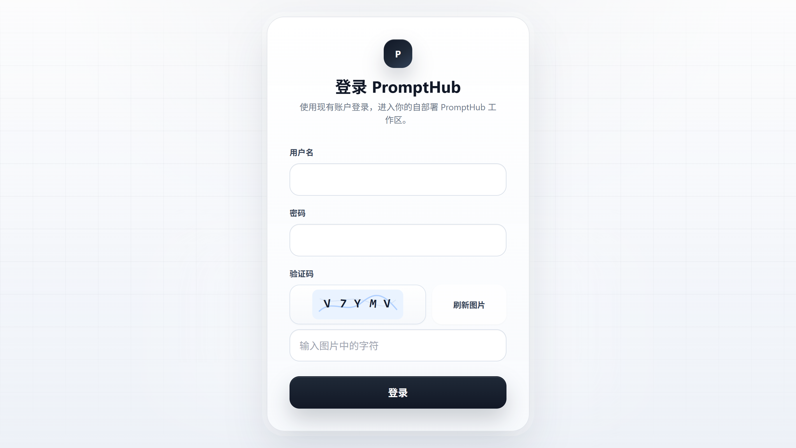

# PromptHub Cloudflare Workers 版

`apps/web-cloudflare` 是 PromptHub 的 Cloudflare Workers 自部署实现。它独立于 `apps/web` 的 Node/Docker 自部署服务，目的是在不破坏上游 Web 实现的前提下，把在线自部署能力搬到 Cloudflare Workers + D1 + R2。

> 状态：分支实验功能。适合想把桌面版数据同步到 Cloudflare 边缘网络、自行承担 Cloudflare 账号和资源维护的用户。

<div align="center">
  
  <p><strong>Cloudflare Workers 在线自部署登录页</strong></p>
</div>

## 目标

- 保持桌面客户端「Self-Hosted PromptHub」同步协议不变。
- 支持本地客户端把已有数据上传到 Cloudflare 在线自部署版。
- 使用 D1 保存账号、设备心跳、Prompt/Folder/Rules/Skills 同步快照元数据。
- 使用 R2 保存图片和视频媒体。
- 将 Cloudflare 代码集中在 `apps/web-cloudflare`，降低未来跟随上游升级时的合并冲突。

## 功能范围

当前 Cloudflare 版覆盖在线自部署的数据同步和展示能力：

- 账号初始化、登录、刷新、登出、当前用户信息
- 5 位字母数字图形验证码
- Prompt / Folder / Rules / Skills 同步快照
- Prompt CRUD、搜索过滤、标签管理、版本创建 / 回滚 / 删除
- Folder CRUD 与排序
- 图片 / 视频媒体上传、下载、列表
- 桌面客户端同步所需的设备心跳和 manifest

浏览器 / Worker 环境不能等价实现本地文件系统能力，例如安装 Skill 到 Claude / Codex 本地目录、扫描本机技能仓库、直接读取本地 SQLite。此类操作仍由桌面端负责。

## 资源准备

需要你自己的 Cloudflare 账号，并创建以下资源。名称可以自定义，下面只给通用示例，不要把个人账号 ID、真实域名、真实 `database_id` 提交到仓库。

- Worker：`prompthub-worker`
- D1 database：`prompthub_d1`
- R2 bucket：`prompthub-media`
- R2 preview bucket：`prompthub-media-preview`
- Worker secret：`JWT_SECRET`

`JWT_SECRET` 必须是 32 位以上随机字符串。推荐用密码管理器或系统随机命令生成，不要写入 README、Issue、PR 或 Git 历史。

## 配置 Wrangler

编辑 `apps/web-cloudflare/wrangler.jsonc`：

```jsonc
{
  "name": "prompthub-worker",
  "d1_databases": [
    {
      "binding": "DB",
      "database_name": "prompthub_d1",
      "database_id": "replace-with-your-d1-database-id",
      "migrations_dir": "migrations"
    }
  ],
  "r2_buckets": [
    {
      "binding": "MEDIA",
      "bucket_name": "prompthub-media",
      "preview_bucket_name": "prompthub-media-preview"
    }
  ]
}
```

`database_id` 来自 `wrangler d1 create` 的输出。它是你的 Cloudflare 资源标识，提交上游前请确认没有真实值残留。

## 部署

```powershell
pnpm install
pnpm --filter @prompthub/web-cloudflare cf-typegen
pnpm --filter @prompthub/web-cloudflare typecheck
pnpm --filter @prompthub/web-cloudflare test
pnpm build:web:cf

cd apps/web-cloudflare
npx wrangler login
npx wrangler d1 create prompthub_d1
npx wrangler r2 bucket create prompthub-media
npx wrangler r2 bucket create prompthub-media-preview
npx wrangler secret put JWT_SECRET
npx wrangler d1 migrations apply prompthub_d1 --remote
npx wrangler deploy
```

如果你修改了 `wrangler.jsonc` 里的 binding、bucket、D1 或其他 runtime 配置，重新部署前请再次执行 `pnpm --filter @prompthub/web-cloudflare cf-typegen`，以刷新 `worker-configuration.d.ts`。

部署成功后，记录 Worker 输出的访问地址，例如：

```text
https://<your-worker>.<your-subdomain>.workers.dev
```

如果你绑定了自定义域名，也只在自己的部署笔记或 Cloudflare 控制台保存，不要提交到仓库。

## 创建第一个管理员

第一次部署后，先确认初始化状态：

```powershell
curl.exe https://<your-worker-url>/api/auth/bootstrap
```

返回里 `needsSetup` 为 `true` 时，可以创建第一个管理员：

```powershell
.\apps\web-cloudflare\scripts\register-admin.ps1 `
  -BaseUrl "https://<your-worker-url>" `
  -Username "admin"
```

脚本会在本地终端提示输入密码。密码不会写入仓库。验证码图片会保存到系统临时目录，你需要按图片内容手动输入验证码。

## 桌面客户端同步

在桌面端进入「设置 → 数据 → Self-Hosted PromptHub」：

1. URL 填你的 Worker 地址或自定义域名。
2. 填刚创建的用户名和密码。
3. 先点「测试连接」。
4. 再点「上传」把本地工作区同步到 Cloudflare。

初始迁移推荐使用桌面客户端的「上传」按钮，不要直接搬本地 `prompthub.db`。直接读 SQLite 容易漏掉媒体、规则文件、技能文件和 renderer 设置快照。

## 上游同步策略

建议保持两个远端：

- `origin`: 上游仓库，例如 `https://github.com/legeling/PromptHub.git`
- `fork`: 你的 fork 仓库

建议把个人部署分支和上游贡献分支分开维护：

- `cf-workers-selfhost-sync`：个人部署 / 继续迭代分支，可以保留自己的 Worker 名、D1 database id、R2 bucket、自定义域名等真实配置。
- `cloudflare-workers-upstream-contribution`：专门用于给上游开 PR 的公开贡献分支，只保留占位配置和通用文档。

每次个人分支完成一个大版本迭代后，先确认个人分支已经可用并提交，再运行贡献分支同步脚本：

```powershell
.\apps\web-cloudflare\scripts\prepare-upstream-contribution.ps1
```

默认只打印计划，不改分支。确认计划后加 `-Apply`，脚本会要求你输入 `SYNC`，然后从 `origin/main` 重新生成干净的 `cloudflare-workers-upstream-contribution`，只把允许范围内的文件变化从 `cf-workers-selfhost-sync` 应用过去，再重新写入公开 Cloudflare 模板，扫描个人域名、真实 Worker URL、真实 D1 ID、账号 ID、本机路径等敏感信息，并运行 `@prompthub/web-cloudflare` typecheck。这样 PR 历史里不会带上个人部署分支曾经提交过的真实 Cloudflare 配置。

```powershell
.\apps\web-cloudflare\scripts\prepare-upstream-contribution.ps1 -Apply
```

确认要推送 fork 时再加 `-Push`。因为贡献分支会被重新生成为干净历史，推送使用 `--force-with-lease`，不会影响个人部署分支：

```powershell
.\apps\web-cloudflare\scripts\prepare-upstream-contribution.ps1 -Apply -Push
```

如果你有自定义域名、私有 Worker 名、私有 bucket 名等固定关键字，可以放在本地忽略文件 `apps/web-cloudflare/scripts/private-scan-terms.local.txt`，一行一个。该文件不会提交到仓库。也可以临时通过参数传入：

```powershell
.\apps\web-cloudflare\scripts\prepare-upstream-contribution.ps1 `
  -PrivateTerm "your-private-domain.example","your-private-worker-name"
```

`main` 尽量只跟随上游，Cloudflare 工作长期放在独立分支：

```powershell
git fetch origin
git switch main
git merge --ff-only origin/main
git switch cf-workers-selfhost-sync
git rebase main
pnpm build:web:cf
```

当前仓库内建议的最小验证闭环：

```powershell
pnpm --filter @prompthub/web-cloudflare cf-typegen
pnpm --filter @prompthub/web-cloudflare typecheck
pnpm --filter @prompthub/web-cloudflare lint
pnpm --filter @prompthub/web-cloudflare test
pnpm build:web:cf
```

如果上游改了桌面 self-hosted 同步协议，优先检查：

- `apps/desktop/src/renderer/services/self-hosted-sync.ts`
- `apps/desktop/src/renderer/services/self-hosted-auth.ts`
- `packages/shared/types/sync.ts`

Cloudflare 分支应尽量只改 `apps/web-cloudflare`、`docs/cloudflare-workers.md` 和必要的共享类型 / 测试，减少未来合并冲突。

## 贡献前脱敏清单

提交或创建 PR 前，至少检查：

```powershell
rg -n "https://[^<\s\""]+\.workers\.dev|account_id|[A-Z]:\\|<your-private-domain>|<your-private-worker-name>" README.md docs apps/web-cloudflare
```

允许保留通用字段名和产品名，例如 `D1`、`R2`、`JWT_SECRET`、`wrangler`、`database_id`、`bucket_name`。不应保留真实账号 ID、真实 D1 database id、真实 bucket 名、真实 Worker 域名、真实自定义域名、本机绝对路径或个人 fork 地址。
