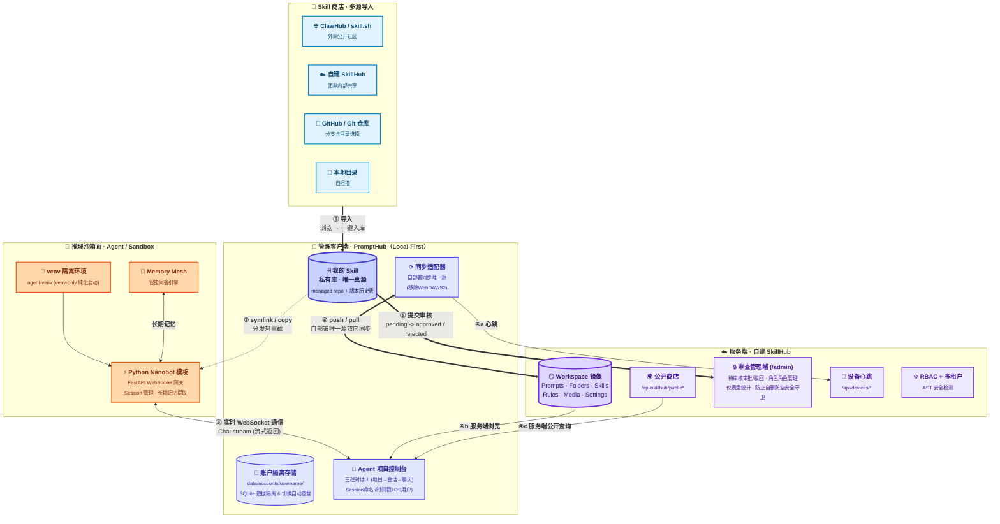

# 16:9 架构汇报单页幻灯片 (One-Pager) 详细大纲与内容展开

---

### 📌 幻灯片标题 (Slide Title)
**全景蓝图：本地优先的个人智能工作台融合架构与数据衔接机制**

### 📌 幻灯片副标题 (Slide Subtitle)
**基于云端注册源、本地控制面与沙箱执行面的"发现-导入-管理-同步-分发-执行-回流"全生命周期智能体开发运行闭环**

---

### 🎨 版式布局与设计系统 (Layout & Design System)
*   **画布尺寸**：标准 16:9 宽屏（1920px × 1080px）浅色扁平风。
*   **空间构图**：左-中-右三栏非对称卡片布局（左 20% 服务端 SkillHub、中 40% 管理客户端 PromptHub、右 40% 推理与沙箱执行面 Agent），底部横贯蓝色（**双向同步流**）+ 橙色（**执行与会话流**）+ 翠绿（**审查回流流**）三色管道。
*   **配色基线**：浅色背景 `#FFFFFF` / `#F8FAFC`，节点用低饱和度浅色填充（青蓝 / 紫 / 靛 / 橙），深色边框与深色文字保证对比度；hub 节点（账户隔离存储 / 我的 Skill / Workspace 镜像）使用稍深一档的填充以突出"数据源"语义。

---

### 📊 图形化表达方案 (Visual & Diagram Schema)

> 整体三栏（云端注册源 / 本地控制面 / 推理执行面），上下分层；emoji 图标 + 三色流 + 编号与正文一一对应。

#### 🗂 图例（图边可放小卡片）

| 流标号 | 线型 / 颜色 | 含义 |
|---|---|---|
| ① | 实线蓝（`==>`） | 商店 → 我的 Skill：多源导入与重复检查 |
| ② | 虚线靛（`-.->`） | 我的 Skill → 项目 / Agent：**symlink 软链 / copy**，规则选择稳定性加固 |
| ③ | 实线橙（`-->`） | Client ↔ Python Sandbox：**实时 WebSocket 串流会话** |
| ④ | 实线蓝绿（`<==>`） | 我 ↔ 服务端 Workspace：**自部署专属双向同步备份** |
| ④a | 实线灰 | 心跳上报与冲突对齐 |
| ④b / ④c | 实线灰 | 服务端浏览我的私有 / 公开查询 |
| ⑤ | 实线翠绿（`==>`） | 我的 Skill → 服务端：**提交审核及回流流转** |

---

### 📝 详细结构化汇报正文 (Detailed Technical Core Text - 约 950 字)

#### 一、 三端核心定位与技术特征 (Three Projects: Characteristics & Roles)
本架构由**服务端**、**管理客户端**与**推理沙箱面**解耦协作构成。
1. **【服务端】SkillHub（自建）**：AI 技能的云端元数据中心与安全注册表，承担以下核心职责：
   * **管理员审核后台与安全 RBAC**：独立管理后台 (`/admin`) 支持仪表盘统计、待审核列表、全量技能管理和用户角色（admin/user）升降，对普通用户进行路由拦截阻断，防误操作保护（不能撤销最后一个 admin）；
   * **审核审批流转机制**：技能发布至云端采取“提交审核”机制，数据库 skills 表增加 `approval_status` (pending / approved / rejected) 状态机，驳回后回滚至私有状态，公开上架后进入商店；
   * **同步元数据清单与轻量比对 (GET /manifest)**：提供 `/manifest` 端点返回当前云端数据的版本、资源计数、上次同步时间等，便于客户端在传输大数据前进行本地/云端状态的快速增量检测；
   * **云端数据拉取与数据导出 (GET /data)**：提供 `/data` 读取端点，对登录用户的 Prompts、Folders、Skills、Media 等多维度资产进行导出打包（导出为 JSON 镜像快照），支持客户端的一键拉取还原；
   * **同步数据推送与原子写入 (PUT /data)**：提供 `/data` 写入端点，接收客户端上传的 Workspace 备份包，自动解析并做 Schema 与合规校验，原子化更新服务端 SQLite 数据库。
2. **【管理客户端】PromptHub**：本地优先的个人提示词与技能控制台，引入以下三大机制：
   * **账户隔离本地存储**：桌面端登录同步账户后，数据目录自动隔离切换到以用户名命名的子目录（如 `data/accounts/zzq02/`），退出登录恢复到本地访客目录，账户切换时自动重载并对齐数据库和设置状态；
   * **Agent 项目与会话管理控制台**：内置完整的 Agent 项目管理框架，支持从模板导入或创建项目。会话 ID 采用时间戳加 OS 用户名命名（`session_YYYYMMDD_HHmmss`），支持新建会话、自动重连 WebSocket 及空态建议问题；
   * **规则选择加载加固**：规则视图的 `selectRule` 切换时立即清空当前文件和草稿以防止 stale read 覆盖新选择；RulesManager 保存按钮和 textarea 在 `isLoading` 时自动禁用，规避竞态下的误保存。
3. **【推理沙箱面】Agent (Python Sandbox)**：纯化的本地代码执行与流式推理层：
   * **venv-only 独立沙箱**：内置 Python 虚拟环境 (`agent-venv/`)，移除不安全的系统 Python 环境变量查找和 Electron 路径 fallback 容错，通过精细化路径解析和纯化 venv 启动规避崩溃；
   * **FastAPI WebSocket Gateway**：沙箱内运行 Python nanobot Agent 模板（内置 Session 管理与长期记忆提取），通过 WebSocket 长连接与 PromptHub 客户端建立全双工实时会话。

#### 二、 软链治理：单一真源 + 多视图 (Single Source of Truth, Many Views)
PromptHub 在“我的 Skill → 视图”这一段统一走本地软链：
* **symlink（默认）**：项目 Skill 目录 / Agent Skill 目录里只是一条指向 managed repo 的链接，在 PromptHub 编辑就是真源编辑，所有视图即时同步。
* **copy**：把快照复制一份到目标目录。适合需要把 Skill "冻结"到某个项目某个版本、或者 Agent 工具不识别 symlink 的场景。

所有变更都先落回账户隔离的「我的 Skill」再分发，**视图侧永远不持有"独占真源"**，避免了多端编辑导致的版本冲突与状态漂移。

#### 三、 五大核心数据工作流闭环 (5-Pillar Interconnection & Closed-Loop)
* **① 商店导入流（Skill 商店 → 我的 Skill）**：支持多源（ClawHub、GitHub 仓库等）一键「导入到我的 Skill」。导入时引入重复发布与命名冲突检查，防止本地同名 Variant 被覆盖。
* **② 技能分发与规则加固流（我的 Skill → Agent 运行空间）**：通过 OS 级 symlink 写入 Agent 规则文件与技能；Rules 工作区通过即时清空加载状态和操作阻断，确保分发后的规则选择与保存状态具有强一致性。
* **③ 实时对话与沙箱执行流（管理客户端 ↔ venv 沙箱）**：管理客户端的 Agent 聊天面板发起对话时，后台通过 venv 激活内置的 Python Nanobot 进程，建立 WebSocket 连接，实现实时流式问答与 CoT（思维链）中间过程回显。
* **④ 账户隔离双向云同步流（我的 Skill ↔ 服务端 Workspace 镜像）**：PromptHub 同步适配器向自建服务端发送 `/api/sync/data` 请求。用户可手动进行“测试连接”（成功后对齐账号路径）并执行“备份到远端 (Push)”或“从远端更新 (Pull)”进行覆盖与还原；后台支持启动自动拉取以及定时自动同步（可设时间间隔），确保多设备协作与换机迁移时的数据一致性。
* **⑤ 技能审核与回流流转（我的 Skill → 云端商店）**：本地调优成熟的 Skill 一键向自建 SkillHub 提交审核。发布流程由原本的本地状态修改改为“上传 Web 数据库 + 写入 pending 状态”，由管理员进行合规审批后，上架至公开商店。

#### 四、 设计取舍与边界 (Trade-offs)
* **为什么弃用 WebDAV/S3 转向单一自部署同步源？**：多云源增加了冲突合并的复杂性，且产生大量平台特异性冗余代码。采用统一的自部署 PromptHub API 协议能够确保多端设备的心跳对齐、账户隔离迁移和数据库底层重载的原子性。
* **为什么要在客户端内建 Python venv 纯化沙箱和 WebSocket 对话？**：外部 Agent 工具依赖繁杂且易受系统环境污染崩溃。内建 `agent-venv/` 保证了沙箱执行的开箱即用；WebSocket 能够实现全双工流式会话，使 PromptHub 成为集管理、开发、执行于一体的一站式智能体工作台。
* **为什么引入审批流和管理员后台面板？**：企业/团队共享 SkillHub 场景下，私有 Skill 的回流与公开必须经过安全审计和 AST 检测。采用“提交审核 -> 管理员审批”的闭环，配合 `/admin` 下的用户角色管理，保障了企业级 AI 资产的安全合规。
