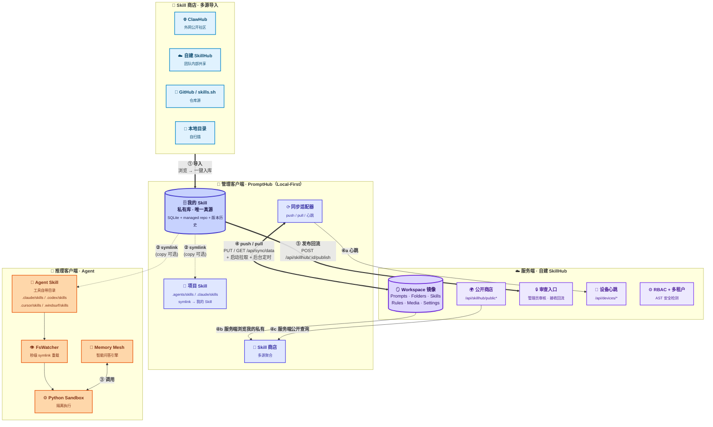

# 16:9 架构汇报单页幻灯片 (One-Pager) 详细大纲与内容展开

---

### 📌 幻灯片标题 (Slide Title)
**全景蓝图：本地优先的个人智能工作台融合架构与数据衔接机制**

### 📌 幻灯片副标题 (Slide Subtitle)
**基于云端注册源、本地控制面与沙箱执行面的"发现-导入-管理-同步-分发-执行-回流"全生命周期智能体开发运行闭环**

---

### 🎨 版式布局与设计系统 (Layout & Design System)
*   **画布尺寸**：标准 16:9 宽屏（1920px × 1080px）浅色扁平风。
*   **空间构图**：左-中-右三栏非对称卡片布局（左 20% 服务端 SkillHub、中 40% 管理客户端 PromptHub、右 40% 推理客户端 Agent），底部横贯蓝色（**双向同步流**）+ 橙色（**执行流**）+ 翠绿（**回流流**）三色管道。
*   **配色基线**：浅色背景 `#FFFFFF` / `#F8FAFC`，节点用低饱和度浅色填充（青蓝 / 紫 / 靛 / 橙），深色边框与深色文字保证对比度；hub 节点（我的 Skill / Workspace 镜像）使用稍深一档的填充以突出"真源"语义。

---

### 📊 图形化表达方案 (Visual & Diagram Schema)

> 整体三栏（云端注册源 / 本地控制面 / 推理执行面），上下分层；emoji 图标 + 三色流 + 编号与正文一一对应。

#### 🗂 图例（图边可放小卡片）

| 流标号 | 线型 / 颜色 | 含义 |
|---|---|---|
| ① | 实线蓝（`==>`） | 商店 → 我的 Skill：多源导入 |
| ② | 虚线靛（`-.->`） | 我的 Skill → 项目 / Agent：**symlink 软链** |
| ③ | 实线橙（`-->`） | Agent 内部：FsWatcher → Sandbox + 引擎调用 |
| ④ | 实线蓝绿（`<==>`） | 我 ↔ 服务端 Workspace：**双向同步备份** |
| ④a | 实线灰 | 心跳上报 |
| ④b / ④c | 实线灰 | 服务端浏览我的私有 / 公开查询 |
| ⑤ | 实线翠绿（`==>`） | 我的 Skill → 服务端：**发布回流** |

> **图边可补三色色块**（与正文底部管道一致）：蓝 = 同步流 / 橙 = 执行流 / 翠绿 = 回流流。

---

### 📝 详细结构化汇报正文 (Detailed Technical Core Text - 约 800 字)

#### 一、 三端核心定位与技术特征 (Three Projects: Characteristics & Roles)
本架构由**服务端**与**双客户端**解耦协作构成。
1. **【服务端】SkillHub（自建）**：AI 技能的云端元数据中心与核心注册表，承担四类职责：
   * **技能后端管理 & RBAC**：多租户命名空间、第三方脚本静态 AST 安全检测、管理员审查流；
   * **公开 Skill 商店**：`/api/skillhub/public*` 公开目录浏览 / 搜索 / ZIP 下载，供 PromptHub 的 Skill 商店层消费；
   * **个人 Workspace 镜像**：用 `/api/sync/*` 端点（manifest / data 双向 push & pull / status / config / WebDAV push&pull）接收每个用户的整库数据 —— Prompts、Folders、Skills、Rules、Media、Settings 一并打包，让服务端成为用户个人数据的镜像与备份；
   * **设备管理**：通过 `/api/devices/*` 记录每个用户的设备清单与心跳，便于多设备协作场景下做冲突检测与"最后写入胜出"提示。
2. **【管理客户端】PromptHub**：本地优先的个人提示词与技能控制台。内部按"**1 真源 + 2 视图 + 1 多源商店 + 1 同步适配器**"五层组织：
   * **我的 Skill（私有库 · 唯一真源）**：SQLite 元数据 + managed repo 路径，所有保存自动写版本历史（diff / rollback / 命名版本），是所有"被引用 Skill"的最终落点；
   * **项目 Skill（项目级视图）**：当前打开项目上下文里的 `.agents/skills/` / `.claude/skills/` 等扫描目录，**以 symlink 指向我的 Skill 里的某些条目**，项目维度不污染全局库；
   * **Skill 商店（多源导入）**：可同时接入 ClawHub（外网公开）、自建 SkillHub、GitHub 仓库（anthropics/skills 等）、skills.sh、本地目录；命中后一键「导入到我的 Skill」，从此私有化、本地化、可版本化；
   * **Workspace 同步适配器**：通过 `pushToSelfHostedWeb` / `pullFromSelfHostedWeb`（底层调服务端的 `GET/PUT /api/sync/data`）把整库推上/拉回服务端；启动时自动拉取最新一次、后台定时推送当前进度，保证我的 Skill 与服务端 Workspace 镜像始终可双向恢复；
   * **Symlink 软链分发引擎**：把「我的 Skill」中的条目以 symlink / copy 双模式部署到 15+ Agent 工具的 skill 目录（Agent Skill 视图）。
3. **【推理客户端】Agent**：独立的智能对话交互与执行客户端。前端承载智能对话问答，核心依靠 **Memory Mesh 双层记忆网格**（短期上下文 + 长期向量特征精简蒸馏）进行智能推理增强；引擎层**通过 FsWatcher 实时监听 Agent Skill 目录的 symlink 变更**，以零停机热挂载方式动态加载 PromptHub 部署的 Skill，并在隔离的 Python 进程沙箱内安全执行投研或通用智能体任务。

#### 二、 软链治理：单一真源 + 多视图 (Single Source of Truth, Many Views)
PromptHub 在"我的 Skill → 视图"这一段统一走本地软链：
* **symlink（默认）**：项目 Skill 目录 / Agent Skill 目录里只是一条指向 managed repo 的链接，在 PromptHub 编辑就是真源编辑，所有视图即时同步。
* **copy**：把快照复制一份到目标目录。适合需要把 Skill "冻结"到某个项目某个版本、或者 Agent 工具不识别 symlink 的场景。

复制还是软链，所有变更都先落回「我的 Skill」再分发，**视图侧（项目 Skill / Agent Skill）永远不持有"独占真源"**，避免"项目里改了一份、桌面里看不到"的歧义。

#### 三、 五大核心数据工作流闭环 (5-Pillar Interconnection & Closed-Loop)
* **① 商店下载流（Skill 商店 → 我的 Skill）**：管理客户端的 Skill 商店可同时面向 ClawHub、自建 SkillHub、GitHub、本地目录发起浏览 / 搜索 / 分页请求；命中后一键「导入到我的 Skill」，下载落库、生成结构化 Markdown，**从此该 Skill 私有化、本地化、可版本化**。ClawHub 与 SkillHub 上的公开 skill 是"可消费的素材"，「我的 Skill」是"被消费的资产"。
* **② 技能重载流（我的 Skill → Agent）**：用户在 PromptHub 切换 Skill 激活态 / 选中目标平台 / 选中目标项目时，main 进程通过 `SKILL_INSTALL_MD_SYMLINK` 写一条 OS 级 symlink 到 Agent Skill 目录；Agent 运行时 FsWatcher 秒级捕捉变更并热重载配置，无需重启问答引擎。
* **③ 推理与工具执行流（Agent ↔ 个人用户）**：用户与 Agent 交互提问时，问答引擎结合 Memory Mesh 记忆，自动匹配并调度由 PromptHub 分发的 Skill，在 Python 隔离沙箱中受限运行脚本，流式拦截 stdout 渲染中间实数与 CoT 思维链。
* **④ 双向同步备份流（我的 Skill ↔ 服务端 Workspace 镜像）**：PromptHub 的 Workspace 同步适配器把「我的 Skill」及其同源工作区（Prompts / Folders / Rules / Media / Settings）打包成统一快照 —— 启动时 `pullFromSelfHostedWeb` 自动从服务端拉取最新一次镜像（换机恢复 / 跨设备协作），后台定时 `pushToSelfHostedWeb` 把本地最新状态推回服务端做备份；同时调 `/api/devices/heartbeat` 上报心跳，让服务端知道当前设备在同步。Skill 商店层也可通过 `GET /api/skillhub/private` 在服务端浏览"已同步上去的我自己的私有 skill"列表，结合公开商店与个人私有形成"我的 / 公开 / 私有"三段浏览视图。
* **⑤ 技能发布回流（我的 Skill → SkillHub）**：在本地调试成熟的自定义 Skill，可通过 PromptHub 安全上报通道发布回 SkillHub 服务端（`POST /api/skillhub/:id/publish`），经管理员审查安全合规后入公共商店，再被其他用户从 Skill 商店浏览 / 导入。发布回流失败**不回滚**本地 visibility —— Local-first 永远成立。

#### 四、 设计取舍与边界 (Trade-offs)
* **为什么不直接上云？** Local-first 是产品定位，也是合规护城河。「我的 Skill」默认留在用户磁盘；只有用户显式配置自部署 Web 时，Workspace 同步适配器才会上线；服务端是**镜像 / 备份 / 社区注册表**，不是用户的"个人云盘"。
* **为什么软链而不是双向同步？** 双向同步会引入冲突解决 / 时间窗口 / 离线合并难题；软链本质是"OS 级指针"，写只可能发生在一处（真源侧），视图侧天然只读 / 实时同步，把同步问题退化成了文件系统问题。
* **为什么 Workspace 同步走整库快照而不是 per-skill diff？** 个人数据规模小（Prompts/Folders/Skills/Rules 总和通常 < 数千条）、整库快照实现最简、冲突恢复策略最清晰；per-skill diff 适合超大协作场景但当前用户画像不必。需要时可叠加。
* **为什么商店要支持多源？** 不同源有不同的优势：ClawHub 偏社区热度、自建 SkillHub 偏团队内部共享、GitHub 偏可控可审、本地目录偏"我机器上已经有的 skill"。导入是单向收敛 —— 无论从哪来，都会被「我的 Skill」私有化后形成统一管理面。
* **为什么服务端只承担"注册表 + Workspace 镜像 + 设备列表"三类角色？** 服务端不是"个人云盘"，也不是"执行沙箱"。它的角色是**跨用户的分享 / 发现 / 治理 + 个人备份 / 多端协作**。个人数据始终留在桌面端，技能执行始终在 Agent 端，三方各司其职。
