# 设计方案：桌面端多账号本地数据物理隔离及同步权限联动

本设计方案阐述如何在桌面端根据同步验证状态，动态划分本地物理隔离区，并在 UI 层面对远程操作按钮（备份、推送、拉取、同步）进行状态联动锁定。

## 1. 物理目录结构
```text
C:\Users\<OS_Username>\AppData\Roaming\PromptHub\
├── global-config.json               # 全局主进程配置，包含 lastActiveAccountId 等
└── users/                           # 用户隔离区
    ├── <OS_Username>/               # 本地离线/未验证访客数据（通过 os.userInfo().username 获取，如 Administrator）
    │   ├── data/
    │   │   ├── prompthub.db
    │   │   ├── skills/
    │   │   └── prompts/
    │   └── logs/
    └── <accountId>/                 # 已验证绑定的服务端账号隔离数据
        ├── data/
        │   ├── prompthub.db
        │   ├── skills/
        │   └── prompts/
        └── logs/
```

## 2. 同步状态与操作权限矩阵

| 用户状态 | 数据存储目录 | 远程备份/还原 | 远程推送/拉取 | 本地文件导入导出 |
| :--- | :--- | :--- | :--- | :--- |
| **未启用同步或测试未通过** | `users/<OS_Username>/` | 🚫 **禁用** (置灰并提示需先验证自部署) | 🚫 **禁用** (置灰并提示需先验证自部署) |  **允许** |
| **自部署测试验证通过** | `users/<accountId>/` |  **允许** |  **允许** |  **允许** |

## 3. 核心重载与联动交互

```mermaid
sequenceDiagram
    participant R as Renderer (设置页 / Store)
    participant M as Main (主进程 IPC)
    participant DB as Database Layer

    R->>R: 用户配置同步信息，点击“测试连接”
    R->>M: 调用 webdav:testConnection
    M-->>R: 返回测试成功 { success: true }
    R->>M: 调用 database:switch-account, { accountId }
    M->>DB: closeDatabase() (关闭旧连接)
    M->>M: 切换 runtimePathOverrides.userDataPath 至 users/<accountId>
    M->>M: 将 lastActiveAccountId: accountId 写入 global-config.json
    M->>DB: initDatabase() (打开并迁移新环境数据库)
    M-->>R: 返回切换成功 { success: true }
    R->>R: 更新 syncVerified = true 状态，重载本地 Store 列表
    R->>R: 解锁同步/推送/远程备份操作按钮
```



## 4. 详细修改设计

### 4.1 渲染进程同步状态管理 (`renderer/stores/settings.store.ts`)
- 引入 `isSyncVerified` 状态属性。
- 当用户在“数据同步”面板配置完 WebDAV 凭证，并点击“测试连接”验证通过后，将 `isSyncVerified` 置为 `true`。
- 如果测试失败、注销登录或清空同步配置，将 `isSyncVerified` 置为 `false`。
- **IPC 绑定**：在验证成功的瞬间，调用 `window.api.database.switchAccount(accountId)` 切换环境；在清空配置时，调用 `window.api.database.switchAccount(null)` 切回访客态（自动回落到当前操作系统用户名文件夹）。

### 4.2 渲染端界面置灰与提示 (`renderer/components/settings/`)
- 在“同步设置”、“备份与恢复”等面板中：
  - 检查当前 Store 中的 `isSyncVerified`。
  - 若为 `false`：
    - 将“立即推送本地数据”、“从云端拉取覆盖”、“远程备份”等按钮设为 `disabled`。
    - 在按钮旁边展示 subtle 提示信息或 Tooltip（例如：“请先测试并保存数据同步设置以启用此功能”）。

### 4.3 主进程 IPC 与数据库连接层 (`main/database/index.ts`)
- 暴露 `database:switch-account`：
  - 调用 `closeDatabase()`。
  - 更新 `lastActiveAccountId` 配置并写回。
  - 调用 `initDatabase()` 重启数据库及运行 Schema 迁移。
  - 返回成功状态。
