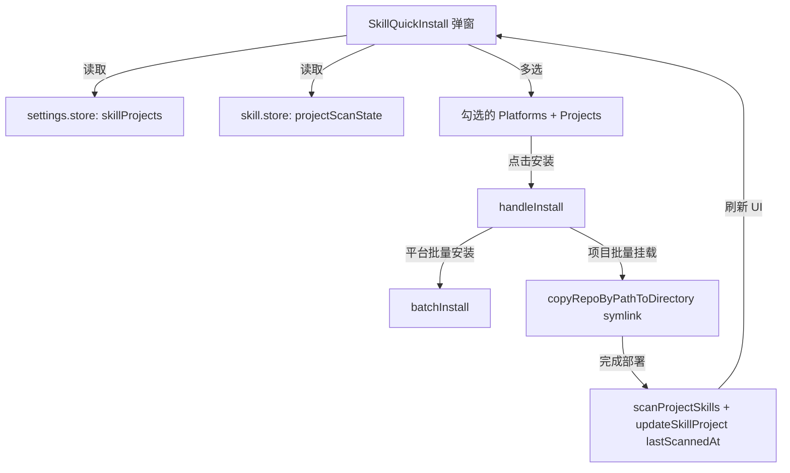

# Design

## Core Changes

### 1. UI Integration in `SkillQuickInstall.tsx`
- 从 `settings.store` 读取 `skillProjects` 获取已注册项目。
- 引入 `FolderIcon` 以展示项目图标。
- 展现“选择要安装的项目”区块，并使用两栏网格展示项目选项。
- 与平台卡片保持一致的卡片状态（已安装/可勾选/加载中）。
- 调用 `batchInstall()` 执行平台安装，调用 `window.api.skill.copyRepoByPathToDirectory` 执行项目的软链接挂载。

### 2. Method Extraction in `project-skill-targets.ts`
- 移动并导出 `getProjectDeployTargets(project)`。
- 使其成为高内聚的公共助手函数，同时提供给详情页和弹窗组件。

## State Flow

## Risks & Fallbacks

- **Windows 软链接创建权限**：Windows 操作系统上创建软链接可能需要开发人员模式或管理员权限。如果失败，`copyRepoByPathToDirectory` 会抛出错误，系统将通过 Toast 反馈具体项目的失败原因，而不是默默忽略。
